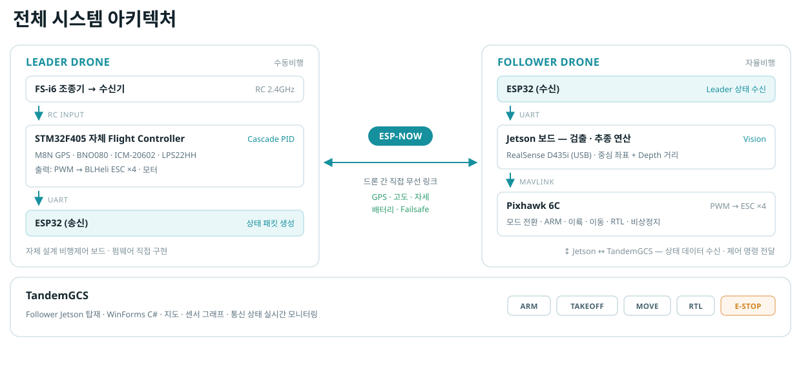
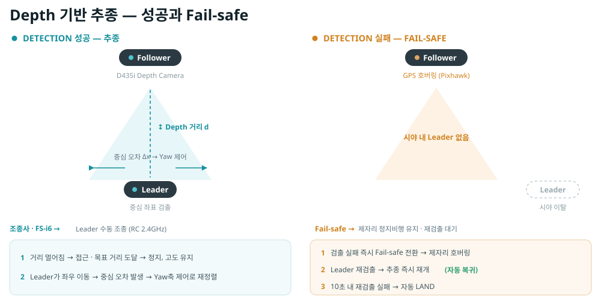
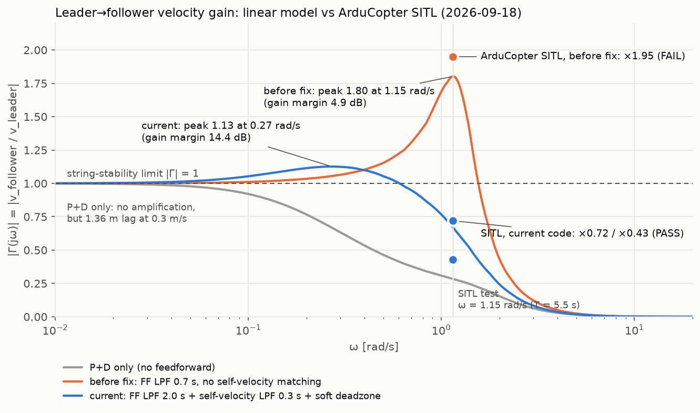
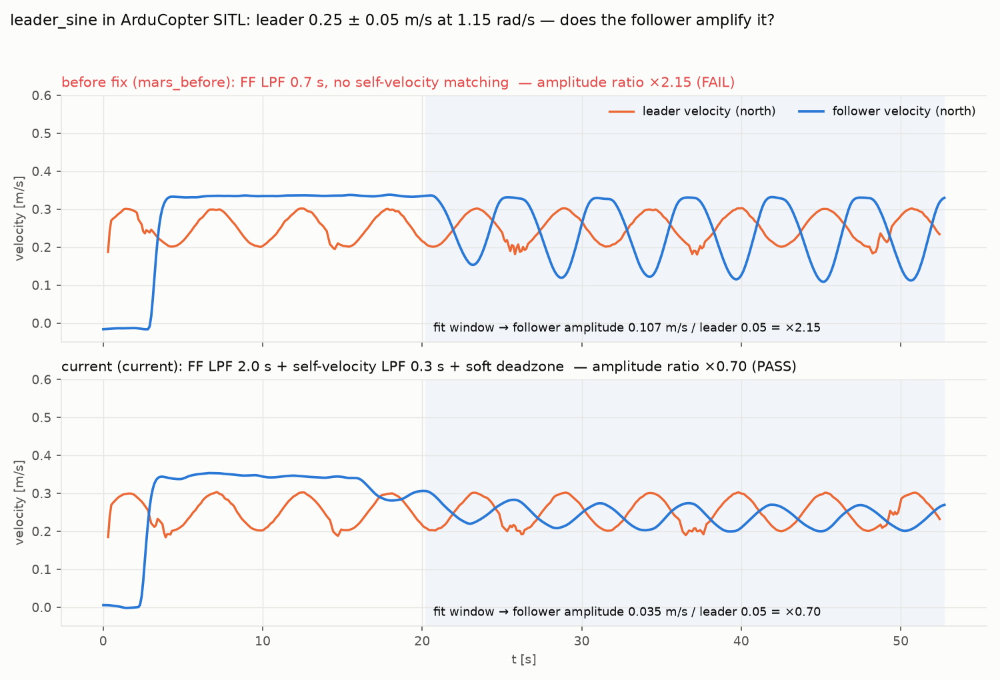
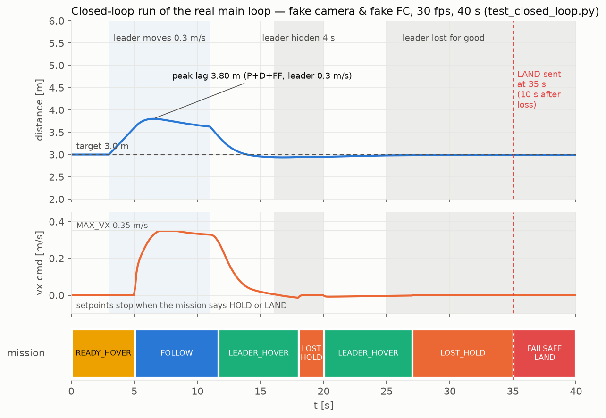

# MARS-IMM — Leader-Follower Drone

**선두 드론을 눈으로 보고 따라가는 팔로워 컨트롤러.** RealSense D435i의 RGB-D 영상에서 YOLO11n으로
선두 드론을 탐지하고, IMM-EKF로 상대 위치·속도를 추정해 Pixhawk에 body-frame 속도 명령을 10Hz로
보냅니다. Jetson에서 단일 프로세스로 돕니다. 영남대 종합설계(캡스톤) 과제.

```
D435i ─▶ YOLO11n ─▶ 트래커 ─▶ IMM-EKF ─▶ 미션 상태머신 ─▶ P·D 제어 ─▶ MAVLink 10Hz
        (TensorRT)   (IoU)    (CV+CT 2모델)   (추종/호버/소실/착륙)      (BODY_NED)
```

## 전체 시스템

<p align="center">
  
</p>

**이 저장소는 위 그림의 `Jetson 보드` 한 칸입니다** — 팔로워의 인지·추정·제어 코드 전부.
리더측 자체 FC 펌웨어와 TandemGCS는 같은 캡스톤 과제의 별도 구성요소이고, ESP-NOW 선두
텔레메트리는 **선택 사항**입니다(리더측 송신 펌웨어 미구현, 비전 단독으로 동작).

## 핵심 결과

| | |
|---|---|
| **Jetson 실기** | 카메라 파이프라인 **24~26 FPS**, 선두 드론 탐지 → **모터 구동까지 지상 확인** |
| **SITL 비행** | ArduCopter SITL에서 **실제 `main.main()`을 그대로 비행**시켜 **8개 시나리오 전부 통과** |
| **제어 정확도** | 리더 0.3 m/s 추종 시 정상상태 거리 **4.3m — 이론값 4.36m와 소수 둘째 자리 일치** |
| **조종사 우선** | 비행 중 조종사가 스위치로 탈환하면 컴패니언이 즉시 물러남 (SITL 25초 유지 검증) |
| **소실 대응** | 선두를 놓치면 10초 뒤 `FAILSAFE_LAND` — 기본 정책은 **제자리 호버 유지 + GCS 알림**(조종사가 착륙), `mission.autonomous_land=True` 면 자동 LAND(SITL 실측 10.0초) |
| **회귀 스위트** | 단위 검사 169개 + 폐루프 시나리오 8종 + SITL 시나리오 9개 + 선형 모델 안정성 여유 분석, 전부 **차등 검증** 방식 |
| **실비행 안전** | ArduCopter 4.5 소스로 확인한 FC 방벽 + 컴패니언 방벽 16종 + 지상 점검 12항목 + 단계별 비행 계획 — [docs/FLIGHT_SAFETY_CHECKLIST.md](docs/FLIGHT_SAFETY_CHECKLIST.md) |
| **PX4 호환** | ArduCopter·PX4 양쪽 모드 프로토콜 지원, PX4 SITL로 검증 |

## 추종 동작과 Fail-safe

<p align="center">
  
</p>

검출이 살아 있으면 Depth 거리로 간격을 잡고 중심 오차로 기수를 맞춥니다. 검출이 끊기면 즉시
제자리 호버로 물러나 재검출을 기다리고, **10초 안에 리더가 돌아오지 않으면 `FAILSAFE_LAND`** 로 갑니다.
오른쪽 그림의 3단계가 그대로 `mission_manager.py`의 `FOLLOW → LOST_HOLD → FAILSAFE_LAND` 전이입니다.
그 상태에서 실제로 LAND 모드를 보낼지는 정책입니다(`config.py` `mission.autonomous_land`). **기본값은 False** —
0 속도(FC 가 위치 유지)를 계속 보내고 GCS 에 `MARS: FAILSAFE_LAND (holding, no LAND)` 를 띄워 조종사가 착륙합니다.
느린 리더가 깊이창 밖으로 걸어 나가거나, 사람 리더가 앉거나, EKF 원점이 1 m 틀리거나, 하늘 배경에서 깊이만 10초 끊기면
전부 "리더가 멀쩡히 보이는데 엉뚱한 곳에 LAND" 가 되기 때문입니다(근거는
[docs/FLIGHT_SAFETY_CHECKLIST.md](docs/FLIGHT_SAFETY_CHECKLIST.md) 5절). True 로 켜면 SITL 실측대로 10.0초 뒤 LAND 를 **한 번**
보냅니다 — 착륙 결정 뒤에 받은 heartbeat 가 GUIDED 일 때만이라 조종사가 직전 1초 안에 탈환했으면 나가지 않습니다.

## 시스템 개요

단일 스레드 `while` 루프 하나가 전부입니다. ROS도 threading도 async도 없습니다 —
Jetson 한 장에서 인지부터 제어까지 42ms 주기로 돕니다.

```
D435i (color+depth, 640×480@30)
   └─> YOLO11n 검출 (scheduler가 ROI·검출 주기 결정)
         └─> IoU 단일 표적 트래커 (bbox 지수 평활, 근접 게이트로 신원 유지)
               └─> 측정 생성  RGB-D 3D  또는  bearing 2D
                     └─> 신뢰도 기반 R 팽창 + Mahalanobis 게이팅
                           └─> IMM-EKF (CV + Coordinated-Turn 2모델)
                                 ├─ ESP32 선두 텔레메트리 융합 (선택)
                                 └─> 미션 상태머신
                                       └─> P·D 제어 → body-frame 속도 setpoint
                                             └─> MAVLink SET_POSITION_TARGET_LOCAL_NED (10Hz)
```

**좌표계 체인**: pixel → camera → FRU → BODY_NED, ENU → FRU. 체인 전체를 SITL에서 검증했습니다
(명령 방향 대 실제 이동 방향 오차 -0.1°). 프레임 `MAV_FRAME_BODY_NED`(8), type_mask 1479
(속도 + yaw rate 사용, yaw 각도 무시). hold는 같은 마스크에 yaw_rate=0.0.

**24~26 FPS는 제어에 충분합니다.** setpoint는 10Hz로만 나가면 되고, 24 FPS면 루프가 42ms마다
도니 여유롭습니다 — SITL 실측 setpoint 9.1~9.2Hz, 최대 갭 0.138s (`GUID_TIMEOUT` 3.0s 대비).
평활 계수는 `dt` 보정을 넣어 실제 FPS와 무관하게 같은 응답 시정수를 갖습니다.

## 제어 법칙

네 축 모두 P+D 에 리더 속도 피드포워드를 더해 제어합니다. 상대 위치·속도는 IMM-EKF 추정값
(FRU: front/right/up)이고, 리더 속도 `v_L` 은 FC 가 주는 자기 속도(LOCAL_POSITION_NED, 0.3 s 정합 저역통과)와
EKF 상대 속도의 합입니다.

| 축 | 명령 | 식 |
|---|---|---|
| 전후 | 거리 유지 | `KFF × v_L,front + KP_FORWARD × (front − TARGET) + KD × v_front` |
| 좌우 | 측면 정렬 | `KFF × v_L,right + KP_RIGHT × right + KD × v_right` |
| 상하 | 고도 정렬 | `KFF × v_L,up + KP_UP × up + KD × v_up` |
| 기수 | 시야 중앙 유지 | `KP_YAW × atan2(right, front)` |

추정 불확실성(`pos_cov_trace`)이 크면 전체 명령에 0.55 / 0.75배 감속이 걸립니다.

위치 오차 `(front − TARGET, right, up)` 은 **편대 슬롯 오차**의 특수형입니다 — 슬롯을 설정하지 않으면 후미 자신의 시선 기준
"리더 뒤 TARGET_DISTANCE_M" 슬롯이 되어 위 식과 비트 단위로 같은 명령이 나옵니다. 슬롯을 리더 heading 기준으로 주면
(`config.formation.slots`, ArduPilot `FOLL_OFS_TYPE=1` 과 같은 개념) 후미 여럿이 선두 하나를 V 자 등으로 따라갈 수 있는 토대가
됩니다. 체인이 아니라 **선두 속도 방송**(`ff_source="broadcast"|"auto"`) 을 쓰는 이유, 기체 기울기가 제어 오차로 새는 결함
(`controller.level_by_attitude`, 기본 꺼짐)과 문헌 근거는 [docs/MULTI_FOLLOWER_FOUNDATION.md](docs/MULTI_FOLLOWER_FOUNDATION.md) 에 있습니다.

**피드포워드가 없으면 정상상태 거리 오차가 `v/KP_FORWARD` 로 남습니다** — 리더 0.3 m/s 에 1.4 m,
1 m/s 에 4.5 m 로 깊이창(10 m) 밖으로 밀려 소실됩니다. 초기 SITL 실측 평형 거리 4.3 m 가 이론값
`3.0 + 0.3/0.22 = 4.36 m` 와 일치한 것이 이 오차입니다. 피드포워드(`KFF = 0.8`)를 넣으면 오차는
`(v − KFF × (v − 0.05))/KP` 로 줄어 0.3 m/s 에 0.45 m 입니다(0.05 는 소프트 데드존).

**피드포워드의 안정성 여유는 선형 모델로 확인했습니다** ([docs/STABILITY_MARGINS.md](docs/STABILITY_MARGINS.md)).
`v_L` 안의 자기 속도는 EKF 상대 속도가 상쇄해 주기까지의 지연 차이만큼 명령에 양성 되먹임되는데, IMM-EKF 의
속도 추정 지연을 실측(63 % 응답 0.30 s)해 계산해 보니 처음 값(저역통과 0.7 s, 정합 없음)은 이득여유 4.9 dB,
1.15 rad/s 에서 리더 속도 변동을 1.8배 증폭하는 스트링 불안정 설계였습니다. 지금은 자기 속도를 EKF 와 같은
0.3 s 로 늦추고 피드포워드 저역통과를 2.0 s 로 늘려 이득여유 14.4 dB, 최대 증폭 1.13 입니다. 데드밴드는 국소
기울기가 3 이던 램프 대신 기울기 1 인 소프트 데드존(0.05 m/s)입니다. 실제 코드로 돌린 4단 체인 시뮬레이션이
선형 예측과 4 % 안에서 맞고, SITL `leader_sine` 시나리오(ArduCopter 실측 0.72배, 수정 전 코드 1.95배)가 이를 확인했습니다.

<p align="center">
  
</p>

리더 속도 변동이 팔로워에서 몇 배가 되는가(`|Γ(jω)|`). 회색이 P+D 단독, 주황이 수정 전 피드포워드(1.15 rad/s 에서
1.80배), 파랑이 현재(최대 1.13배). 점은 같은 주파수에서 ArduCopter SITL 로 실측한 값으로, 수정 전 코드 1.95배(FAIL),
현재 코드 0.72 / 0.43배(PASS). 곡선은 `analysis/stability_margins.py`, 그림은 `analysis/readme_figures.py` 가 만듭니다.

<p align="center">
  
</p>

같은 시나리오를 ArduCopter SITL 에서 실제로 비행시킨 기록입니다(`sitl/results/`, 그림은 `analysis/sitl_figures.py`).
리더가 0.25 ± 0.05 m/s 로 5.5 초 주기로 가감속할 때, **수정 전 코드(위)는 팔로워 속도 진폭이 2.15배로 커지고 위상도
반대로 돌아갑니다.** 현재 코드(아래)는 0.70배로 리더보다 완만하게 따라갑니다. 차등 검증이라 수정 전 코드에서 결함이
실제로 재현되는 것까지 확인했습니다.

## 안전 설계

비행 안전과 관련된 동작은 전부 SITL에서 실제 비행으로 검증했습니다.

- **조종사가 항상 이깁니다.** 컴패니언은 FC 모드를 매 루프 확인하고, GUIDED/OFFBOARD가
  아니면 모드 변경 명령을 보내지 않습니다. 조종사가 LOITER로 탈환하면 그대로 유지됩니다
  (SITL 25초 검증).
- **선두 소실 시 호버, 착륙은 정책.** 거리 관측이 끊기면 호버로 버티다가 총 10초 뒤 `FAILSAFE_LAND` —
  깊이 센서만 죽고 검출이 살아 있는 교묘한 경우까지 거리 기준(`range_coast_time`)으로 잡습니다.
  LAND 송신은 `mission.autonomous_land`(기본 False = 호버 유지 + GCS 알림) 로 켭니다.
- **명령이 될 수 없는 값은 명령이 되지 않습니다.** NaN/inf 는 `clamp` 에서 0 으로 잘리고(예전 max/min 구현은 NaN 을
  +0.35 전진으로 바꿨습니다), 제어기가 입력을 검증하며, EKF 상태가 비유한이면 추정기를 리셋합니다. 리더 텔레메트리의
  Infinity/NaN/20 m/s 초과 속도 패킷은 버립니다.
- **FC 상태를 모르면 움직이지 않습니다.** ATTITUDE/LOCAL_POSITION 이 1초 이상 정체되면 정지 명령, HEARTBEAT 가 3초
  이상 정체되면 모드 불명으로 보아 모드 변경을 보내지 않고 링크 복구 시 미션을 리셋합니다.
- **전방 1.2 m 정지.** 추적과 무관하게 원시 깊이 영상 중앙에 1.2 m 보다 가까운 덩어리가 있으면 전진을 막습니다.
- **깊이는 가장 가까운 무리.** 속이 빈 드론 기체는 bbox 안쪽 영역의 절반 이상이 배경이라 단순 중앙값이 배경(8 m)을
  잡아 "멀다"고 전속 전진합니다 — 가장 가까운 깊이 무리의 중앙값을 씁니다(사람처럼 단단한 표적은 동일).
- **기울기가 명령이 되지 않습니다.** 기체가 pitch −10° 로 기울면(맞바람) 같은 고도 리더에 vz −0.09 m/s 가 나가
  0.5 m 위로 올라가 정착했습니다 — `controller.level_by_attitude`(기본 True)가 roll/pitch 를 되돌립니다.
- **천장.** GUIDED 인계 고도 + 5 m 위에서는 상승 명령을 막습니다(`MAX_CLIMB_ABOVE_ENTRY_M`).
- **이륙 인계가 안전합니다.** 수동 상승 후 GUIDED로 넘기는 순간 미션·명령 버퍼를 리셋해
  깨끗한 상태로 추종을 시작합니다 (SITL 검증).
- **고도 바닥.** `MIN_AGL_M`(2.0 m, EKF 원점 기준) 아래에서는 하강 명령을 차단하고, 고도를 모르면(LOCAL_POSITION 정체)
  하강 자체를 막습니다.
- **GPS만으로는 붙지 않습니다.** 카메라 깊이가 끊기고 ESP32 GPS 상대위치만 남으면 이격을
  3m에서 8m(`TARGET_DISTANCE_GPS_ONLY_M`)로 넓힙니다 — GPS 상대오차는 m 단위라 3m는
  오차보다 작고, 8m는 깊이창(10m) 안이라 리더가 다시 보이면 비전이 이어받습니다.
- **기본값이 dry-run.** `SEND_MAVLINK_COMMANDS = False`가 기본이라, 켜기 전까지는 인지·추정·
  화면 표시가 전부 돌면서 명령은 전송되지 않습니다.
- **카메라 hiccup 내성.** 프레임 드롭은 드롭으로 처리하고, 헤드리스(`MARS_SHOW_WINDOW=0`)
  환경에서도 동작합니다.
- **출발·정지·착륙 판단은 리더의 절대 속도로 합니다.** 자기 속도(FC)와 EKF 상대 속도의 합, ESP32 가
  있으면 그 절대 속도. 상대 속도만 보면 후미가 선두 속도를 맞추는 순간 0 이 되어 "선두 정지"로 오판하고,
  후미가 하강 중이면 상대 vz 가 양수라 선두의 실제 착륙을 놓칩니다. 자기 속도가 없으면 상대 속도로 폴백합니다.
- **돌풍에 기운 기체를 리더 이동으로 오해하지 않습니다.** FC의 ATTITUDE(roll/pitch/yaw) 변화량으로
  매 프레임 EKF 상대상태를 역회전합니다(`ego_rotation_cam`). 10° pitch면 640px 화면에서 타겟이
  68px 움직이는데, 보정 없이는 이것이 속도 명령으로 나갑니다.
- **실외 노출.** 컬러 센서에 AE priority off(30fps 고정)·노출 상한 8ms(모션 블러)·역광 보정을 걸고,
  AE 측광 영역을 추적 bbox로 따라가게 해 하늘 평균이 아니라 리더에 노출을 맞춥니다
  (`config.py` `camera.*` 키, 미지원 옵션은 로그만 남기고 건너뜀).

## 검증 방법

드론 없이 4층으로 검증합니다. 핵심은 **스텁이 인지 계층(cv2/RealSense/YOLO)뿐이고, 미션
상태머신·제어·MAVLink 송신은 저장소의 실제 코드가 그대로 돈다**는 점입니다.

```bash
python3 test_fixes.py          # 단위 169개 — numpy만 있으면 됨
python3 test_closed_loop.py    # 폐루프 특성화 — 가짜 FC·가짜 시계로 실제 main.main() 결정론 실행 (--dump/--compare)
python3 test_closed_loop.py --scenario tilt|nan|fc_stale|climb|lost_alt|takeover   # 안전 시나리오 (docs/FLIGHT_SAFETY_CHECKLIST.md)
python3 sitl/harness.py --all  # ArduCopter SITL에 붙여 실제로 비행
python3 analysis/stability_margins.py --plots   # 분석 층: 바깥 루프 선형 모델의 여유·스트링 안정성 (matplotlib)
python3 analysis/trace_check.py                 # 요구도 ↔ 검사 추적성
```

<p align="center">
  
</p>

2층 폐루프의 한 실행(`test_closed_loop.py`, 가짜 카메라·가짜 FC 로 실제 `main.main()` 을 30 fps 40 초). 리더가 0.3 m/s 로
움직이면 FOLLOW 로 따라붙고(최대 뒤처짐 3.8 m, 명령은 `MAX_VX` 포화), 리더가 멈추면 LEADER_HOVER 로 3.0 m 에 정착합니다.
4 초 가림은 LOST_HOLD 로 버티다 재검출 즉시 복귀하고, 영구 소실은 10 초 뒤 LAND 를 한 번 보냅니다. 이 스트림이 회귀의
골든 파일입니다.

시험 위에 **분석 층**이 있습니다. IMM-EKF 의 주파수응답을 실측해 바깥 루프의 개루프 전달함수를 세우고 위상·이득
여유, 감도 피크, 리더→팔로워 속도 전달(스트링 안정성)을 계산한 뒤 실제 코드로 돌린 비선형 체인 시뮬레이션과
4 % 안에서 맞췄습니다. **이 분석이 시험이 놓친 결함을 찾았습니다**: 처음의 피드포워드 구현은 이득여유 4.9 dB,
1.15 rad/s 에서 리더 속도 변동을 1.8배 증폭했습니다(P+D 단독은 18.6 dB, 증폭 없음). 등속 리더·계단 시나리오는 그
주파수를 자극하지 않아 SITL 8개가 전부 통과했던 것입니다. 원인(자기 속도와 EKF 상대속도의 지연 불일치)과 수정
(피드포워드 저역통과 2 s + 자기 속도 정합 필터 0.3 s + 소프트 데드존 → 14.4 dB, 1.13배)은
[docs/STABILITY_MARGINS.md](docs/STABILITY_MARGINS.md) 에 있고, 정현파 리더 SITL 시나리오 `leader_sine` 이 이를
ArduCopter 에서 검사합니다(실측: 현재 코드 0.72배, 수정 전 코드 1.95배로 FAIL). 요구도 86개 중 어느 것이 어느 검사로 검증되고 무엇이 미충족인지는
[docs/REQUIREMENTS.md](docs/REQUIREMENTS.md) 의 추적성 표에 있습니다.

그리고 모든 시나리오는 **차등 검증**입니다 — 수정 전 코드에도 같은 시나리오를 돌려 대조군에서
문제가 실제로 재현되는지 확인합니다. 대조군이 통과하는 테스트는 아무것도 증명하지 못하기
때문입니다.

SITL 시나리오 9개: 부팅 대기 · 조종사 탈환 · 공중 오판 방지 · 이동 리더 추종 · 정지 리더
정위치 유지 · 기수 유지 · 소실 시 자동 착륙 · GUIDED 인계 · 정현파 리더(스트링 안정성). 상세 이력과 실측값은
**[VERIFICATION.md](VERIFICATION.md)**, 하네스 실행법은 [sitl/README.md](sitl/README.md).

## 하드웨어

| | |
|---|---|
| 기체 | Holybro X500 V2 + Pixhawk |
| 컴패니언 | NVIDIA Jetson |
| 카메라 | Intel RealSense D435i (640×480 @ 30fps) |
| 선두 텔레메트리 | ESP32 (serial 115200 또는 UDP 5005) — 선택 사항, 비전 단독으로 동작. 고도 기준계는 `LEADER_ALT_FRAME`(AMSL/ELLIPSOID) 또는 패킷 필드명(`alt_msl` / `alt_ellipsoid`)으로 지정 |

## 실행

```bash
pip install numpy opencv-python pymavlink ultralytics pyrealsense2 pyserial

python3 test_fixes.py          # 단위 회귀 (하드웨어 불필요)
python3 main.py
```

`MARS_FC_PORT` 환경변수로 FC 포트를 바꿀 수 있습니다(기본 `/dev/ttyACM0`).
SITL에 직접 붙이려면 `MARS_FC_PORT=udpin:0.0.0.0:14551 python3 main.py`.

키: `q`/`ESC` 종료 · `m` MARS-IMM 토글 · `v` MAVLink 송신 토글 · `l` LAND · `h` HOLD

### Jetson 배포 — TensorRT가 실제로 도는지 확인하기

`.engine`이 있으면 TensorRT, 없으면 `.pt`로 **조용히** 폴백합니다. 폴백된 `.pt`는 CUDA torch가 없으면
CPU FP32로 돌아 FPS가 한 자리수로 떨어집니다. 시작 로그 한 줄로 확인하세요:

```
[YOLO] warm-up 1.8s | backend=TensorRT device=cuda:0 fp16=True imgsz=416
```

`backend=PyTorch`나 `device=cpu`가 보이면 아래 순서로 점검합니다.

```bash
python3 -c "import torch, tensorrt; print(torch.cuda.is_available(), torch.__version__, tensorrt.__version__)"
#   → True 여야 함. False면 PyPI torch(CPU 전용)가 깔린 것 — JetPack용 NVIDIA torch 휠로 교체

# 엔진은 반드시 **같은 Jetson, 같은 JetPack/TensorRT 버전**에서 만든다 (다른 기기 엔진은 로드 실패)
yolo export model=$MARS_MODEL_DIR/leader_drone_yolo11n.pt format=engine imgsz=416 half=True
```

- 모델 위치는 `MARS_MODEL_DIR` 환경변수로 바꿉니다(기본 `/home/dsl/DRONE`).
- 엔진의 imgsz가 `config.py`의 416과 다르면 시작 시 크게 경고하고 **엔진 값을 씁니다**(고정 크기 엔진에 다른
  크기를 넘기면 ultralytics가 첫 추론에서 죽습니다).
- `MARS_SHOW_WINDOW=0`으로 창을 끄면 프레임당 4~8ms(Jetson)를 아낍니다. 창을 켜도 표시는 15Hz로만 그립니다.

모델 경로와 대상 클래스는 `config.py`에서 설정합니다. 시작 시 모델의 클래스 목록과 대조해
설정이 어긋나면 크게 경고합니다.

## 운용 순서

```
[지상]
  1. python3 test_fixes.py                     통과 확인
  2. 프로펠러 제거 상태로 python3 main.py       화면의 명령값이 의도대로 나오는지 확인
  3. SEND_MAVLINK_COMMANDS = True 로 수정       (또는 실행 중 v 키)
  4. 기체 파라미터 WP_YAW_BEHAVIOR=0

[비행]
  5. 조종기로 수동 이륙 (ALT_HOLD)              원하는 고도까지
  6. 고도 안착 후 모드 스위치를 GUIDED 로       ← 이 순간부터 추종 시작
  7. 이상하면 스위치를 LOITER/ALT_HOLD 로       ← 즉시 조종사에게 돌아옴
```

ArduCopter는 속도 setpoint를 **GUIDED에서만** 받으므로, 조종기 3단 스위치가 곧 자동/수동
전환 장치가 됩니다:

| 스위치 | 모드 | 의미 |
|---|---|---|
| 위 | ALT_HOLD | 수동 이륙·고도 잡기 |
| 중간 | LOITER | 비상 탈환 (위치까지 고정) |
| 아래 | **GUIDED** | 자동 추종 |

LOITER로 내리면 컴패니언이 다시 뺏지 못합니다 — SITL에서 검증했습니다.

## 모듈

| 파일 | 역할 |
|---|---|
| `main.py` | 제어 루프 전체 — 상수, 명령 생성, MAVLink 송신, 상태 표시 |
| `mission_manager.py` | 미션 상태머신 (WAIT_LEADER / READY_HOVER / FOLLOW / LOST_HOLD / FAILSAFE_LAND …) |
| `formation.py` | 선두 1 : 후미 N 토대 — 편대 슬롯(리더 heading / NED / 시선 기준), 리더 상대 heading 추정, `FOLLOW_TARGET` 호환 리더 상태 방송 스키마, 슬롯 정적 유효성 |
| `imm_ekf.py` | 2모델 IMM-EKF (CV + Coordinated-Turn) |
| `scheduler.py` | 검출기 on/off와 ROI 크기 스케줄링 |
| `reliability.py` | 신뢰도 기반 R 팽창 + Mahalanobis 게이팅 |
| `leader_telemetry.py` | ESP32 선두 GPS/속도 수신·파싱·ENU 변환·융합 |
| `measurement.py` | bbox + depth → RGB-D 3D / bearing 2D 측정 |
| `tracker.py` | IoU 단일 표적 트래커 (bbox 지수 평활, 근접 게이트) |
| `detector.py` | YOLO11n 래퍼 (TensorRT `.engine` 우선) |
| `camera.py` | D435i 래퍼 (depth→color 정렬, 실제 depth_scale 조회, 실외 노출 옵션·AE 측광 ROI) |
| `utils_geometry.py` | 순수 기하 헬퍼 |
| `logger.py` | JSONL 스트리밍 로거 (종료 시 CSV 변환) |
| `test_fixes.py` | 단위 회귀 129개 (하드웨어·FC 불필요) |
| `test_closed_loop.py` | 폐루프 특성화 테스트 — 가짜 FC·가짜 시계로 실제 `main.main()` 결정론 실행, `--dump`/`--compare`로 리팩토링 전후 스트림 비교 |
| `sitl/` | SITL 회귀 하네스 · 실행 안내 |
| `docs/images/` | README 다이어그램(SVG) |

## 문서

- [VERIFICATION.md](VERIFICATION.md) — 검증 방법론과 SITL 차등 검증 이력
- [docs/MULTI_FOLLOWER_FOUNDATION.md](docs/MULTI_FOLLOWER_FOUNDATION.md) — 코드 정밀 분석(데이터 흐름·발견 결함), 문헌·ArduPilot/PX4 소스 기준의 제어 판단, 선두 1 : 후미 N 확장 토대
- [docs/FORMATION_THEORY.md](docs/FORMATION_THEORY.md) — 편대 이론(이론 우선 트랙): 선두 방송 토폴로지의 스트링 안정성 정리, 시간간격 정책의 최소 h, 포화·이득 전환에 대한 원판 판별법 절대안정성, 실제 코드 체인 시뮬 검증, 졸업 논문 구성 제안 (`analysis/formation_theory.py`)
- [docs/STABILITY_MARGINS.md](docs/STABILITY_MARGINS.md) — 바깥 루프 선형 모델, 위상·이득 여유, 스트링 안정성, 체인 시뮬레이션, 개선안
- [docs/REQUIREMENTS.md](docs/REQUIREMENTS.md) — 요구도 86개와 검사·시나리오·분석으로의 추적성 표 (`analysis/trace_check.py` 로 자동 대조)
- [docs/FLIGHT_SAFETY_CHECKLIST.md](docs/FLIGHT_SAFETY_CHECKLIST.md) — 실비행 안전 점검서: ArduCopter 소스로 확인한 FC 동작, FC 파라미터, 지상 점검 12항목, 단계별 비행 계획, 남은 위험
- [docs/EXPERIMENT_PROTOCOL.md](docs/EXPERIMENT_PROTOCOL.md) — 논문(AST)용 비행 캠페인: UWB 거리 GT 장비·교정, 실험 카드 E1~E7, 분석 도구(`analysis/id_flight.py`·`identify_plant.py`·`sine_gain.py`·`nees_nis.py`), go/no-go 기준
- [sitl/README.md](sitl/README.md) — SITL 회귀 하네스 실행법
- [docs/images/README.md](docs/images/README.md) — README 그림 파일과 수정 방법
