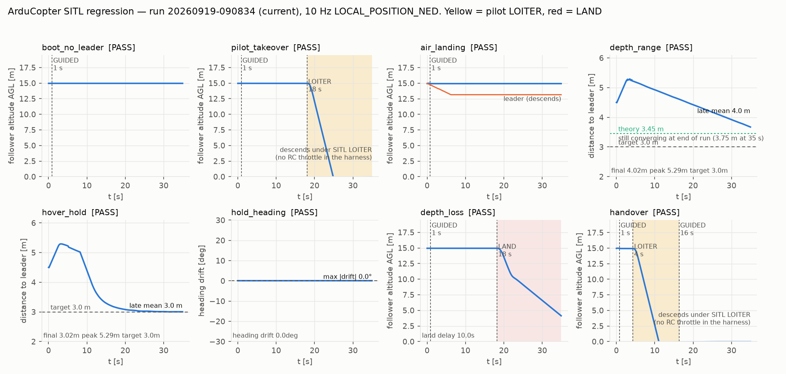

# 검증 이력

드론은 한 번 떨어뜨리면 되돌릴 수 없어서, **비행 전에 검증할 수 있는 것은 전부 지상에서
검증한다**는 원칙으로 작업했습니다. 이 문서는 그 방법과 결과입니다. 사용법은
[README.md](README.md)를 보세요.

## 방법

**1. 차등 검증** — 모든 시나리오를 수정 **전** 코드에도 돌려 결함이 실제로 재현되는지
확인합니다. 대조군이 통과하는 테스트는 아무것도 증명하지 못하기 때문입니다. 결함이
서로를 가리는 경우(예: 부팅 즉시 LAND가 다른 결함의 조건 도달을 막음)에는 **해당 결함
하나만 되돌린 격리 대조군**을 만들어 씁니다.

**2. 실제 코드를 비행시킴** — SITL 하네스는 인지 계층(cv2 / RealSense / YOLO)만 스텁하고,
미션 상태머신 · 제어 법칙 · MAVLink 송신은 저장소의 실제 `main.main()`이 그대로 돕니다.
`SEND_MAVLINK_COMMANDS=True`로 실제 명령이 나가고 SITL 기체가 실제로 움직입니다.

**3. 소스로 결론 내기** — 재현되지 않는 주장은 "재현 안 됨"으로 끝내지 않고 오토파일럿
소스에서 이유를 찾습니다. C5가 그 사례입니다(아래).

```bash
python3 test_fixes.py                        # 단위 149개, 하드웨어 불필요
python3 analysis/stability_margins.py        # 안정성 여유 분석 (docs/STABILITY_MARGINS.md)
python3 analysis/trace_check.py              # 요구도 추적성 (docs/REQUIREMENTS.md)
python3 sitl/harness.py --all                # SITL 10개 시나리오
python3 sitl/harness.py --all --repo <수정전> # 차등 대조군
```

## 현재 상태

| 영역 | 상태 |
|---|---|
| 좌표계 변환 체인 | ✅ SITL 2회 독립 재현, 오차 -0.1° |
| `BODY_NED` + mask 1479 | ✅ body 기준으로 정확히 동작 (`BODY_OFFSET_NED`로 바꾸지 말 것 — PX4가 거부) |
| 제어 법칙 자체 | ✅ 과감쇠·안정. 정지 리더 정상상태 오차 +0.00m, 5만 프레임 NaN/발산 0 |
| 10Hz setpoint 유지 | ✅ 실측 9.1~9.2Hz, 최대 갭 0.138s (`GUID_TIMEOUT` 3.0s 대비 여유) |
| coast / 재획득 | ✅ 0.5~3초 블랙아웃 전부 정상 |
| 미션 상태머신 | ✅ C1·C3·H2 SITL 차등 검증 |
| 센서 유효범위 | ✅ C4 SITL 차등 검증 (0.3 m/s 리더 추종) |
| 조종사 탈환 | ✅ C2 SITL 차등 검증 (LOITER 25초 유지) |
| 소실 판정 | ✅ 거리 기준으로 교체, 깊이 소실 10.0초 뒤 착륙 확인 |
| 표적 신원 | ✅ 회복 시 근접 게이트 (검출률 60% 대응) |
| PX4 경로 | ✅ C6 PX4 SITL 차등 검증 |
| 수정본 SITL 재검증 | ✅ C1·C2·C3·C4·C6·H2 차등 검증 / C5는 증상 발생 불가로 판정 |
| Jetson 실기 (지상) | 🔶 리더 검출 → 모터 구동까지 확인 (개발자 보고) |
| **실비행** | 🔶 미수행 — [조건부 시험 비행 가능](README.md#운용-순서) |

## 수정 완료 (2026-09-07)

`python3 test_fixes.py` — 당시 18개 검사 전부 통과(이후 검사가 늘어 현재 149개). 하드웨어 없이 순수 로직만 검증합니다.

### C1 — 부팅 즉시 FAILSAFE_LAND

`_lost_time()`이 `last_seen_t is None`에 `999.0`을 반환했습니다. 리더를 **한 번도 본 적 없는
부팅 직후**가 정확히 이 조건이라, `999.0 > lost_hold_sec(5.0)`으로 첫 프레임에
`S_FAILSAFE_LAND`로 직행했습니다.

**수정**: "한 번도 못 봄"과 "놓침"을 분리. `update()`에서 `last_seen_t is None`이면
`S_WAIT_LEADER`(HOVER, `land=False`)로 보냅니다. 센티넬 `999.0`도 `0.0`으로 교체.

### C2 — 조종사 수동 탈환이 무효화됨

`SETPOINT_PERIOD_SEC = 0.10` 주기로 `set_mode("LAND")`를 재송신해, 조종사가 LOITER로 탈환해도
**100~135ms 만에 다시 LAND로 끌려갔습니다.** FC 모드는 1Hz 출력 블록에서만 읽고 경고만 찍었습니다.

**수정**: FC 모드를 매 루프 읽어 `fc_accepts_setpoints`(GUIDED/OFFBOARD)를 만들고, **LAND와 속도
setpoint 양쪽 송신을 이 게이트로 하드 스톱**합니다. LAND는 모드 게이트 자체가 latch 역할을 합니다 —
명령이 먹으면 모드가 GUIDED를 벗어나 분기가 실행되지 않고, 안 먹었을 때만 `LAND_RETRY_SEC`(2초)
간격으로 재시도합니다. (단순 one-shot latch는 LAND 유실 시 영영 재시도하지 않는 새 결함이 됩니다.)

### C3 — 공중에서 착륙 판정 통과

리더 절대고도가 `None`일 때 **상대** z로 대체했습니다. 동고도 편대비행에서 상대 z는 0 근처라
고도 조건(`< 0.65m`)이 **항상 만족**되어, 공중에서 `CONFIRMED_LANDING`이 났습니다.

**수정**: fallback 삭제. 절대(대지) 고도가 없으면 착륙 판정 자체를 하지 않습니다.

### C4 — 깊이 절벽

`depth_max_m = 6.00` vs `TARGET_DISTANCE_M = 5.0` — 여유 1m뿐이었습니다. P제어 정상상태
평형거리가 `TARGET + v_leader/KP_FORWARD`이므로 **리더가 0.22 m/s만 넘어도 평형점이 깊이창
밖**이었습니다. `max_depth_mad`는 정의만 되고 아무도 쓰지 않는 죽은 상수였습니다.

**수정**: `depth_max_m` 10.0, `TARGET_DISTANCE_M` 3.0 → 여유 7m (리더 약 1.5 m/s까지).
`max_depth_mad`를 실제 게이트로 연결 — 깊이 산포가 한계를 넘으면 신뢰도 0을 반환해,
median이 outlier에 앉았을 때 제어가 전속 후진으로 포화되던 경로를 막습니다.

### C5 — yaw mask가 기체를 스스로 돌게 함

`yaw_rate ≈ 0`일 때 `YAW_RATE_IGNORE`를 세워, ArduCopter가 `WP_YAW_BEHAVIOR`(기본 2)로 기수를
스스로 돌렸습니다. 프레임이 `BODY_NED`라 이후 모든 속도 명령이 함께 회전했고, SITL 실측에서 실제
이동이 명령 대비 **164.6° 어긋났습니다.**

**수정**: 분기 삭제 — 항상 mask 1479. `yaw_rate=0.0` + 비트 clear = "현재 기수 유지"가 의도한
동작입니다. **기체 파라미터도 `WP_YAW_BEHAVIOR=0`으로 설정해야 합니다.**

### C6 — PX4에서 LAND 시도 시 루프 사망

`mode_mapping()[name]`을 int로 가정했으나 **PX4는 3-튜플**(`"LAND"` → `(29, 4, 6)`)을 반환합니다.
uint32 필드에 튜플을 넣다가 `struct.error`가 나고, 예외 처리가 없어 **비행 중 제어 루프가
죽었습니다.**

**수정**: `master.set_mode(mode_name)`에 위임(pymavlink가 apm/px4 자동 분기) + `try/except`로
non-fatal화 → `AUTO.LAND` 재시도와 `MAV_CMD_NAV_LAND` fallback에 실제로 도달합니다.

### H2 — 호버 리더 정위치 유지가 존재하지 않음

`S_LEADER_HOVER`가 출발판단 블록에 있어 진입 다음 프레임에 `READY_HOVER`로 덮여 **정확히
1프레임(~33ms)**만 생존했습니다. 헤드라인 유스케이스가 동작하지 않았습니다.

**수정**: `S_LEADER_HOVER`를 FOLLOW 블록에서 처리. 히스테리시스 추가(진입 0.18 m/s, 복귀
0.25 m/s). 두 상태 모두 `allow_follow=True`라 **"따라잡아서 상대속도가 준 것"과 "리더가 멈춘 것"을
혼동해도 제어가 끊기지 않습니다** — 기존의 ~1Hz 정지/재출발 스터터도 함께 해소됩니다.

## SITL 회귀 검증

ArduCopter 4.8.0-dev SITL(네이티브 arm64 빌드)에 **저장소의 실제 `main.main()`을 그대로 붙여**
비행시켰습니다. 스텁은 인지 계층(cv2 / RealSense / YOLO)뿐이고 미션 상태머신 · 제어 · MAVLink
송신은 전부 실제 코드입니다. `SEND_MAVLINK_COMMANDS=True`로 실제 명령이 나갑니다.

**차등 검증** — 같은 시나리오를 수정 전(`HEAD~1`) 코드에도 돌려, 결함이 실제로 재현되는지
확인했습니다. 대조군이 통과하는 테스트는 아무것도 증명하지 못하기 때문입니다.

| 시나리오 | 수정 후 | 대조군 |
|---|---|---|
| **C1** 리더 미획득 상태로 대기 | ✅ 35초간 GUIDED 유지, LAND 없음 | ❌ **t+0.9초에 LAND 전환** |
| **C2** FAILSAFE_LAND 중 조종사 LOITER 탈환 | ✅ LOITER 25초 유지, 송신 차단 확인 | ❌ **0.6초 만에 LAND로 뺏김** |
| **C3** 절대고도 없음 + 리더 하강 | ✅ 착륙 판정 안 남 | ❌ **t=2.6초, 고도 15m에서 착륙 판정** |
| **C4** 0.3 m/s 리더 추종 | ✅ 후반 4.3m (목표 3.0m) | ❌ **10.8m — 따라붙지 못함** |
| **H2** 리더 정지 후 정위치 유지 | ✅ 후반 3.0m (목표 3.0m) | ❌ **6.0m에서 정지, 수렴 안 함** |
| **C6** PX4 3-튜플 `mode_mapping` | ✅ 예외 없음 (PX4 SITL) | ❌ **`required argument is not an integer`** |
| **거리 게이트** 깊이만 소실 (검출은 유지) | ✅ **10.0초 뒤 LAND** | ❌ **35초 내내 GUIDED — 착륙 안 함** |
| **인계** 수동 상승 12초 후 GUIDED 전환 | ✅ LAND 없음 | ❌ **전환 0.1초 만에 LAND** |
| **C5** 기수 제어권 이양 (`c5_probe.py`) | 5.0° 유지 | 1.0° 유지 — **증상 발생 불가** |

C4의 4.3m는 P 제어 평형거리 이론값 `TARGET + v/KP_FORWARD = 3.0 + 0.3/0.22 = 4.36m`와
소수 둘째 자리까지 일치합니다.

**C3·C4·H2의 대조군은 결함별 격리본입니다.** 수정 전 전체 코드는 C1이 부팅 1~3초 만에 LAND를
걸어 다른 결함의 조건에 도달조차 못 하므로, 수정본에서 해당 결함 하나만 되돌린 사본을 썼습니다
(자세한 내용은 [`sitl/README.md`](sitl/README.md)).

C2 대조군의 모드 이력이 결함을 그대로 보여줍니다:
`GUIDED(2s) → LAND(15.1s) → LOITER(15.1s, 조종사) → LAND(15.2s, 컴패니언이 탈환)`.
수정 후에는 `GUIDED(2s) → LAND(15s) → LOITER(15s)`에서 끝까지 LOITER를 유지합니다.

### C5는 SITL에서 재현되지 않았습니다

이전 감사가 보고한 "기수 자동 회전으로 실제 이동이 명령 대비 164.6° 이탈"이 **이번 SITL에서는
나타나지 않았습니다.** 양쪽 arm의 `TARGET_DISTANCE_M`을 동일하게 고정해 이동량을 통제하고
`WP_YAW_BEHAVIOR=2`(공장 기본값)로 두었는데도 기수 편차가 양쪽 다 0.0°였습니다.

`WP_YAW_BEHAVIOR`가 GUIDED 속도 제어에는 적용되지 않고 waypoint 항법에만 적용되는 것으로
보입니다. **마스크 수정(항상 1479) 자체는 유효하며 단위 테스트로 확인**되지만, 그 수정이 막는다고
주장했던 증상은 이 조건에서 검증되지 않았습니다. 기체 파라미터 `WP_YAW_BEHAVIOR=0` 권고는
비용이 0이므로 유지합니다.

### C5는 증상이 발생할 수 없습니다 — 소스로 확정

세 가지가 겹칩니다. (1) 공장 기본값 `WP_YAW_BEHAVIOR=2`는 LOOK_AHEAD가 아니라 LOOK_AT_NEXT_WP이고
GUIDED 속도 제어엔 waypoint가 없습니다. (2) LOOK_AHEAD(값 3)는 **진입 시 현재 기수로 초기화**되고
지면속도 1.0 m/s 초과에서만 갱신됩니다(`autoyaw.cpp:88-91`, `config.h:476`). (3) 이 포크는
`yaw_rate`를 `allow_follow` 안에서만 계산하므로 **버그 마스크는 명령 속도가 0일 때만** 나갑니다
(계측: 620여 setpoint 전부 `|v|=0.00`). 게다가 후진 속도 상한이 `KP_FORWARD×(TARGET−front)`
= 약 0.66 m/s라 문턱에 구조적으로 도달할 수 없습니다.

마스크 수정은 유지합니다(명시가 위임보다 낫고 비용 0). 다만 **C5는 치명 등급이 아니며**,
이전 감사의 "164.6° 이탈"은 이 구성에서 발생하지 않습니다. 재현 시도는
[`sitl/c5_probe.py`](sitl/c5_probe.py)에 남겨뒀습니다.

### C6은 PX4 SITL로 별도 검증했습니다

PX4 SITL(`px4_sitl_nolockstep`)에서 `mode_mapping['LAND'] = (29, 4, 6)` — 3-튜플임을 실물로
확인했습니다. C6은 전송 **전** 패킹에서 터지므로 비행이 필요 없습니다. 빌드·실행 절차는
[`sitl/README.md`](sitl/README.md)에 있습니다.

### PX4 OFFBOARD 데드락 — C2 수정 보완

C6 검증을 준비하다 발견했습니다. C2 수정이 처음에는 **LAND와 속도 setpoint를 같은 모드 게이트로**
묶었는데, PX4는 OFFBOARD에 진입하기 전에 setpoint 스트림이 먼저 흐르고 있어야 합니다. 그대로 두면
**PX4에서는 영원히 OFFBOARD에 못 들어가는 데드락**이 됩니다.

조종사를 뺏는 것은 setpoint가 아니라 **모드 변경(LAND)** 이므로 게이트를 그쪽에만 남겼습니다.
속도 setpoint는 GUIDED/OFFBOARD가 아니면 FC가 조용히 버리므로 무해합니다. 이 변경 후 C1·C2를
ArduCopter SITL에서 재검증해 통과를 확인했습니다.

### 트래커 신원 게이트 (2026-09-07 추가)

`tracker.py`가 `lost_count > 0`이면 IoU와 무관하게 **아무 검출이나 수용**했습니다. 검출률이 낮으면
`lost_count > 0`이 정상 상태가 되어 게이트가 사실상 무력화되고, 한 프레임 놓친 사이 화면 반대편의
다른 대상이 트랙을 가져갑니다. **개발자 보고 기준 현재 YOLO 검출률이 약 60%이므로 실제로 자주
발생할 수 있는 조건입니다.**

**수정**: 회복 시에는 겹침 대신 **근접**을 요구합니다 — 중심 이동량이 이전 bbox 대각선의
`0.75 × (1 + lost_count)`배 이내여야 합니다. 정상 기동은 통과하고 화면 반대편 점프는 막힙니다.

### 소실 판정을 거리 기준으로 (2026-09-07 추가)

`leader_visible_for_mission = track_visible or ekf_reliable or esp_visible` —
**`track_visible` 하나로 충분했습니다.** YOLO가 bbox만 내면 미션은 "리더를 보고 있다"고
판단합니다. 깊이가 죽어 bearing-only로 강등돼도(거리 관측 불가) 소실 판정이 나지 않아
**실패 착륙이 영원히 발동하지 않습니다.** `ekf.is_reliable()`도 마찬가지입니다 —
`coast_time`이 bearing-only 업데이트로도 0이 되기 때문입니다.

**수정**: `coast_time`과 별도로 **`range_coast_time`** 을 셉니다. 매 `predict`마다 누적하고
**거리를 담은 측정(RGB-D / ESP32 위치)에서만** 0으로 되돌립니다. 미션 판정은
`ekf.has_range_fix()`를 씁니다. 상태 출력에 `rcoast=`로 함께 표시되므로 운용 중 두 값이
갈라지는 것을 볼 수 있습니다.

**소실 후 착륙까지 총 10초**로 맞췄습니다 — `imm.range_coast_max_sec`(2.0) +
`MissionManager.lost_hold_sec`(8.0). SITL 실측 10.0초.

### 현장 대비 수정 (2026-09-07 감사)

첫 시험 비행을 상정한 다중 에이전트 감사에서 나온 것들입니다.

| 문제 | 현장에서 | 수정 |
|---|---|---|
| `USE_LEADER_ESP32=True` + ESP32 없음 | `serial.Serial()` 예외가 `try` 블록 **밖**에서 나 프로그램이 아예 안 뜸 (100%) | `open_leader_receiver()`가 `start()`를 `try`로 감싸 실패 시 경고 후 `None` → 비전 단독. 기본값은 `True` 유지 |
| **GUIDED 인계 순간 즉시 LAND** | 수동 상승 중 리더가 화면 밖 → 10초 뒤 FAILSAFE_LAND 래치 → 스위치 넘기는 첫 프레임에 착륙 | **GUIDED 진입 에지에서 미션·명령 리셋** |
| 평활 버퍼 포화 | FC가 무시하는 동안 목표값까지 수렴 → 인계 첫 setpoint가 램프 없이 최대 | 같은 리셋에서 `prev_body_cmd` 0으로 |
| 헤드리스 `cv2.imshow` 예외 | 창이 없거나 `ssh -X`가 끊기면 루프가 통째로 사망 | `MARS_SHOW_WINDOW=0` + imshow try/except → 헤드리스로 계속 |
| `target_class_name` 불일치 | 모델에 없는 클래스면 **검출 0건인데 경고 없음** — FPS는 정상이라 원인 찾다 하루 날림 | 시작 시 모델 클래스와 대조해 크게 경고 |
| 카메라 hiccup | `wait_for_frames` 예외가 안 잡혀 비행 중 종료 | 드롭 프레임으로 처리, 연속 30회면 종료 |
| 수직축 바닥 없음 | 리더(또는 지면의 오검출)를 따라 계속 하강 | `MIN_AGL_M`(1.5m) 아래에서 하강 명령 차단 |
| `l`/`h` 키가 거짓 보고 | CMD=DRY인데 "manual LAND command"를 출력해 조작자를 속임 | 실제 송신 여부를 그대로 출력 |

**GUIDED 인계 LAND는 C1 수정의 사각지대였습니다.** C1 가드는 "리더를 한 번도 못 봄"만 막고,
"보다가 상승 중에 놓침"은 막지 못했습니다. 이 저장소의 계획된 운용 절차에서 100% 발생합니다.

## SITL 회귀 재검증 (2026-09-18, Windows/WSL1)

PR #2~#5 의 리팩토링·자세 보정·피드포워드·미션 절대 속도 변경 뒤 ArduCopter SITL 8개 시나리오를 다시 돌려
**전부 PASS** (시나리오당 프레임 985~1019개). 상세는 `sitl/README.md` 의 2026-09-18 표.

이 과정에서 SITL 이 잡아낸 저장소 결함 2건:
- pymavlink 2.4.4x 는 heartbeat 로 `target_component` 를 갱신하지 않아 0 으로 남는데, 2차 리팩토링의
  HEARTBEAT 필터가 컴포넌트 일치를 요구해 FC 모드가 `?` 로 남고 setpoint 송신이 막혔다. 단위 검사는 가짜
  master 가 컴포넌트 1 이라 통과시켰다. → autopilot 유효성 기준으로 판별하고 첫 heartbeat 의 컴포넌트로 고정.
- main 종료 시 FC 소켓을 닫지 않아 같은 프로세스에서 재연결하면 heartbeat 를 영원히 기다렸다 (하네스에서만
  드러나지만 자원 누수 자체는 실기에도 해당).

STAT 줄에 `vL`(리더 절대 속도), `ff`(피드포워드), `fresh=LP/ATT`, `rx[Hz]`(수신율)를 추가해 이런 종류의
"조용히 꺼짐" 을 현장에서 한 줄로 볼 수 있게 했다. 피드포워드는 SITL 에서 `vL=0.28 ff=+0.28` 로 확인.

## 안정성 여유 분석 (2026-09-18)

시험만으로는 "왜 안정한가, 얼마나 여유가 있나"에 답할 수 없어 선형 모델을 세웠습니다. 상세는
[docs/STABILITY_MARGINS.md](docs/STABILITY_MARGINS.md), 계산은 `analysis/stability_margins.py`.

- **방법** — IMM-EKF 는 선형화하지 않고 `imm_ekf.ImmEkf` 에 정현파(0.03~30 rad/s, 28점)를 넣어 위치·속도 추정의
  주파수응답을 실측했습니다(속도 추정 63 % 응답 0.30 s). 그 위에 P+D + 피드포워드 제어기, 평활(0.10 s), 검출·ZOH
  지연(0.10 s), FC 속도루프 1차 지연(0.30 s, 0.2~1.2 s 로 흔들어 확인)을 얹어 개루프 `L(jω)` 와 리더→팔로워
  속도 전달 `Γ(jω)` 를 계산했습니다. 검증은 실제 `main.*` 제어 함수와 실제 `ImmEkf` 로 돌린 비선형 체인
  시뮬레이션과의 대조로 했고, 전 구간 4 % 안에서 일치합니다.
- **결과** — P+D 단독은 PM 86°, GM 18.6 dB, 스트링 안정. **처음의 피드포워드 구현(저역통과 0.7 s, 정합 없음)은
  GM 4.9 dB(좌우축 4.4 dB), 감도 피크 2.31, 1.15 rad/s 에서 `|Γ|` 1.80 으로 스트링 불안정**이었습니다. 원인은 리더
  속도 추정 `v_F + v̂_rel` 에서 FC 자기 속도(지연 0.1 s)와 EKF 상대속도(지연 0.30 s)의 지연 차이만큼 자기 속도가
  되먹임되는 것이고, 코드 주석의 가정(EKF 지연 1 s)과 실측이 달랐습니다. 데드밴드 램프의 국소 기울기 3 도 리더
  0.1~0.2 m/s 에서 증폭을 3.5 로 키웠습니다.
- **왜 SITL 이 못 잡았나** — 등속 리더(`depth_range`)와 계단 응답은 1.15 rad/s 성분이 작아 공진을 자극하지 않고,
  `MAX_VX` 0.35 포화가 진폭을 깎습니다. 그래서 정현파 리더 시나리오 `leader_sine`(0.25 ± 0.05 m/s, 1.15 rad/s,
  팔로워 속도 진폭비 ≤ 1) 을 추가했습니다.
- **수정(적용됨)** — 피드포워드 저역통과 0.7 → 2.0 s(`leader_vel_ff_tau_sec`), 자기 속도에 0.3 s 정합 저역통과
  (`leader_vel_ff_self_tau_sec`, `main.self_velocity_lpf`), 데드밴드를 기울기 1 인 소프트 데드존 0.05 m/s 로.
  전후축 GM 14.4 dB, Ms 1.29, `|Γ|` 1.13(0.27 rad/s) 이고 정상상태 오차는 0.3 m/s 에 0.45 m(수정 전 0.27 m —
  데드존이 빼는 0.05 m/s 만큼)입니다. 4단 체인 시뮬레이션에서 1.15 rad/s 증폭 1.37 → 0.63, 데드밴드 구간 3.5 → 0.70.
  남은 1.13 은 피드포워드와 P 응답의 겹침으로, 3대 이상 체인이면 KFF 0.6(1.02) 또는 ESP32 선두 절대 속도 방송.
- 단위 검사 `분석:` 4개가 기준선 여유, 수정 전 골든값(결함의 기록), 현재 설계 여유를 회귀로 고정합니다.
- **SITL 차등 검증 (2026-09-18, WSL1)** — `leader_sine` 을 현재 코드와 수정 전 코드(커밋 e4b4cd7, `--repo`)로 돌렸습니다.
  **현재 0.43 / 0.72 (두 번 실행) PASS, 수정 전 1.95 FAIL.** 예측(선형 0.67 / 1.8, 비선형 시뮬 0.70 / 2.3) 범위 안입니다.
  수정 전 대조군에서는 추정 리더 속도가 0.15~0.42 로 흔들려 미션이 FOLLOW↔LEADER_HOVER 를 5.5 s 주기로 오가는 것까지
  관측됐습니다. 같은 실행의 회귀 9개 전부 PASS, `depth_range` 후반 거리는 소프트 데드존 때문에 3.9 → 4.1 m.

## SITL 실측 기록 (2026-09-19, 결과 CSV)

하네스가 시나리오마다 10 Hz 시계열을 CSV 로 남기게 하고(`sitl/results/<실행시각>_<태그>/`), 그 데이터로 그림을
만들었습니다(`analysis/sitl_figures.py`). 콘솔 출력만 있던 이전과 달리 숫자의 원본이 저장소에 있습니다.



`20260919-090834_current` 9개 전부 PASS, 대조군 `20260919-091549_mars_before` 의 `leader_sine` FAIL.

| 시나리오 | 결과 | 실측 |
|---|---|---|
| `boot_no_leader` | PASS | 35 초 GUIDED 유지, 고도 14.96 m 그대로 |
| `pilot_takeover` | PASS | 18.0 s LAND → 조종사 LOITER, 재 LAND 없음 |
| `air_landing` | PASS | 리더가 6 초 하강해도 팔로워 고도 유지, 공중 착륙 판정 없음 |
| `depth_range` | PASS | 최대 5.29 m → 35 초 시점 3.75 m, 여전히 수렴 중 (이론 정상상태 3.45 m) |
| `hover_hold` | PASS | 후반 평균 3.02 m |
| `hold_heading` | PASS | 기수 편차 0.0° |
| `depth_loss` | PASS | 깊이 소실 → LAND 10.0 초 |
| `handover` | PASS | GUIDED 인계 후 LAND 없음 |
| `leader_sine` | PASS | 진폭비 **0.70** (대조군 **2.15** FAIL) |

- **피드포워드 수정이 실기 FC 에서 확인됐습니다.** 진폭비 0.70 대 2.15 로, 선형 모델 예측(0.67 / 1.80)과 비선형 체인
  시뮬 예측(0.70 / 2.31) 사이입니다. 그림에서 수정 전 코드는 진폭이 커지는 것뿐 아니라 위상이 반대로 돌아가
  리더가 가속할 때 팔로워가 감속합니다.
- **`depth_range` 는 35 초 안에 정착하지 않습니다.** 소프트 데드존 때문에 정상상태가 3.45 m 로 내려갔고(이전 4.4 m),
  피드포워드 저역통과 2 초 때문에 수렴이 느립니다. 판정 기준(목표+3 m) 안이지만, 평형값을 확인하려면 시나리오를
  60 초 이상으로 늘려야 합니다.
- **하네스 한계 발견: 조종사 역할이 고도를 유지하지 못합니다.** `pilot_takeover` 와 `handover` 에서 LOITER 로 바꾼 뒤
  기체가 지면까지 내려갑니다(CSV 의 `agl_m` 이 0). RC 입력이 없는 SITL 에서 LOITER 는 스로틀을 최소로 읽기 때문입니다.
  두 시나리오의 판정(우리 코드가 LAND 를 다시 보내지 않음 / 인계 직후 LAND 가 없음)은 여전히 유효하지만,
  `handover` 가 의도한 "수동으로 12 초 상승 뒤 공중에서 인계" 는 실제로는 지상에서의 인계였습니다. 조종사 링크가
  RC override 로 스로틀을 올리도록 고쳐야 의도대로 검증됩니다.

## 2026-09-19 수정: 최소 이격, ESP32 속도 게이트, CT 회전율

### SITL 회귀 (2026-09-20)

세 수정 후 `python3 sitl/harness.py --all` 9개 전부 PASS (`sitl/results/20260920-034033_current`).
`hover_hold` 후반 3.02 m, `depth_range` 후반 4.05 m, `depth_loss` 착륙 9.9초, `leader_sine` 진폭비 0.73 으로
수정 전 실행과 같은 수준입니다. 자세한 표는 [sitl/README.md](sitl/README.md).

주의할 점 둘. **최소 이격 제약은 이 회귀에서 한 번도 발동하지 않았습니다** — 최근접이 3.02 m 라 2.0 m 바닥에
닿지 않았습니다. 따라서 이 실행은 "제약이 정상 추종을 방해하지 않는다" 만 보였고, 파고들기를 실제로 막는지는
전용 시나리오가 필요합니다. **`handover` 는 프레임이 807개**로 기준(1000 안팎)보다 적어 다른 8개보다 근거가
약합니다.

### 최소 이격 제약 — 재설계 (2026-09-20)

전용 시나리오를 만들려다 **전날 넣은 제약이 사실상 작동하지 않는다**는 것을 발견했습니다. 목표 3 m·바닥 2 m·
KP 0.22 에서 P 항의 후퇴 `-KP·(3−d)` 와 제약의 허용치 `-KS·(2−d)` 가 1.42 m 에서 교차하므로, 그 위에서는 P 가
항상 더 강합니다. 제약이 무는 유일한 조건은 바닥에서 피드포워드가 0.275 m/s 를 넘을 때인데, 그러려면 리더가
0.39 m/s 이상이어야 하고 그건 MAX_VX 0.35 로는 추종이 안 되는 속도입니다. 회귀에서 한 번도 발동하지 않은 것이
우연이 아니었습니다.

진짜 빈 구간은 **리더가 MAX_VX 보다 빠르게 다가오는 경우**입니다. 정면 후퇴로는 원리적으로 벗어날 수 없습니다.
실제 제어 함수로 돌린 오프라인 모의에서 0.6 m/s 정면 접근은 접촉(0.00 m), 0.7 m/s 도 접촉(0.01 m)이었습니다.
그래서 회피 반경 1.5 m 안에서 시선에 수직인 측면 속도를 얹는 2단계를 추가했습니다. 같은 조건에서 0.54 m,
0.41 m 로 접촉을 면합니다. SITL 시나리오 `min_separation` 이 이를 검사하며 아직 실행하지 않았습니다.

첫 SITL 실행(`20260920-043050_current`)에서 최소 거리 0.65 m, 측면 속도 0.09 m/s 로 통과했지만 판정 여유가
12% 뿐이었습니다. 회피 램프가 `(반경−거리)/반경` 이라 가장 위험한 근거리에서 가장 약했던 것이 원인이라,
반경 안쪽 0.3 m 만에 최대치에 닿도록 고쳤습니다(오프라인 예측 0.66 m / 0.21 m/s). 같은 실행에서 **대조군이
`AttributeError` 로 아예 돌지 못한 것**도 발견했습니다 — 하네스 판정이 새 상수를 직접 참조해 `--repo` 로 옛
코드를 돌릴 수 없었습니다. 차등 검증의 전제를 깨는 결함이라 `getattr` 폴백으로 고쳤습니다.

여유가 0.4 m 라는 것은 안전하다는 뜻이 아닙니다. 이 속도 제한에서 할 수 있는 최선일 뿐이고, 근본 해결은
`MAX_VX`·`MAX_VY` 를 올리는 것입니다(미결 결정).

### 최소 이격 제약 (1단계, 2026-09-19)

선회 시 최근접 1.59 m 가 관측됐는데 목표 이격은 3.0 m 였습니다. 전후축만 보는 P 제어로는 측면으로 파고드는
경우를 막지 못합니다. `main.enforce_min_separation` 이 3차원 시선 방향으로 명령을 사영해, 2.0 m 안으로
들어오면 접근 성분을 제거하고 침범량에 비례해(0.6 m/s per m) 물러납니다. 시선에 수직인 성분은 그대로 둬서
추종이 끊기지 않습니다. 단위 검사 5개로 고정했고 SITL 시나리오는 아직 없습니다.

### ESP32 속도의 게이트 우회 (해소)

예전 `apply_leader_velocity_hint_to_imm` 은 `f.x[3:6]` 에 직접 대입하고 `f.P[3:6,3:6]` 를 0.98배로 줄였습니다.
혁신도 게이트도 우도도 없어서, 잘못된 패킷이 추정을 오염시키면서 동시에 "더 확신한다"고 공분산까지 줄이는
구조였습니다. 지금은 `ImmEkf.update_velocity3d` 와 `ReliabilityEstimator.gate_velocity3d` 를 통해 다른 측정과
같은 경로를 탑니다. 60 m/s 같은 이상치는 게이트에서 거부되고 상태가 전혀 변하지 않는 것을 검사로 고정했습니다.
coast 타이머는 건드리지 않습니다 — 속도 측정은 거리도 가시성도 보장하지 않기 때문입니다.

### CT 모드 확률 (구조적 한계로 재분류, 회전율 추정은 수정)

"mode-aware 가 무동작" 을 고치려다 원인이 둘로 나뉘는 것을 확인했습니다.

**진짜 결함이었던 부분은 회전율 추정입니다.** `_estimate_omega` 가 상태의 **상대** 속도로 진행 방향각을
계산했는데, 추종이 정착하면 상대 속도가 0 으로 수렴해 방향각이 잡음이 됩니다. 측정해 보니 리더의 실제
선회율과 무관하게 omega 가 항상 같은 값(−0.128 rad/s)으로 고정돼 있었습니다. 자기 속도를 더한 **절대**
속도로 바꾸자 잡음 없는 조건에서 참값과 정확히 일치합니다(선회 0.5 → −0.500, 1.0 → −1.000, 카메라 관례상 부호 반전).

**모드 확률이 움직이지 않는 것은 결함이 아닙니다.** 이 필터는 리더의 절대상태가 아니라 **상대상태**를
추정합니다. 팔로워가 잘 따라갈수록 리더의 기동이 상대상태에서 상쇄되어, CV 와 CT 의 예측 차이가 측정 잡음
아래로 사라집니다. 실제로 리더 속도를 0.3에서 5 m/s 까지, 선회율을 0.35에서 1.0 rad/s 까지 올려도(횡가속
0.1 → 5 m/s²) 추종 상황에서는 p_ct 가 전부 0.325~0.329 였습니다. 전이행렬 `[[0.95,0.05],[0.10,0.90]]` 의
정상분포가 정확히 1/3 이고, 우도가 정보를 주지 못하니 거기에 머무는 것이 맞는 거동입니다.

회전율을 고쳐도 융합 출력은 변하지 않습니다. 가림 1.5초 코스팅 예측 오차를 12회 평균으로 비교했을 때
차이가 ±2 % 안이었습니다. CT 가 1/3 가중치로만 들어가기 때문입니다.

**남은 선택지 셋** (요구도 EST-15):
1. CT 모델을 제거하고 단일 CV 로 단순화. 측정상 정확도는 같고 코드와 연산이 줄어듭니다.
2. 리더의 **절대상태**를 필터링하도록 구조 변경. 팔로워 위치·속도를 더해 월드 기준 상태로 두면 리더 기동이
   직접 관측되어 CT 가 실제로 이깁니다. 가림 중 예측이 개선될 여지가 가장 큽니다.
3. 현 상태 유지하고 한계를 명시. 지금 문서가 이 선택입니다.

## 요구도 추적성 (2026-09-18)

[docs/REQUIREMENTS.md](docs/REQUIREMENTS.md) 에 요구도 62개(FCR 17 · EST 15 · SAF 15 · IF 11 · OPS 4)를 ID 로 두고
각각을 `test_fixes.py` 검사 이름, `test_closed_loop.py` 검사, SITL 시나리오, 분석 결과 키, 소스 문자열로 묶었습니다.
`analysis/trace_check.py` 가 참조가 실제로 존재하는지 대조하고(`추적성:` 단위 검사), 폐루프 검사 14개는 전부
요구도에 연결돼 있습니다. 미충족 1개(EST-12 검출률), 미검증 2개(실비행, ESP32 펌웨어), 부분 7개(FCR-10 잔여 피크 1.13 포함)가 표 3절에
필요한 조치와 함께 있습니다.

## 남은 결함

수정하지 않았습니다. 아래 항목은 **시험 비행을 막지는 않지만**, 조건을 벗어나기 전에 처리해야
합니다.

- **`handover` 의 공중 인계가 검증되지 않았습니다.** 위 절의 하네스 한계. 조종사 링크에 RC override 를 넣어
  LOITER 중 고도를 유지하게 고친 뒤 재실행해야 합니다.
- **`depth_range` 의 평형 거리 미확인.** 35 초로는 부족합니다. `--duration 60` 이상으로 재실행하면 이론값 3.45 m
  수렴을 확인할 수 있습니다.
- **스트링 안정성 잔여 피크 1.13 (0.27 rad/s)** — 피드포워드와 P 응답의 겹침. 단독 추종에는 문제없고, 3대 이상
  체인이면 KFF 0.6(1.02) 으로 내리거나 ESP32 선두 절대 속도 방송으로 자기 속도 경로를 없애야 합니다.
- ~~**정상상태 뒤처짐** — 리더 1m/s당 약 4.55m~~ → 리더 속도 피드포워드(KFF 0.8)로 0.91 m/(m/s) 로 해소
  (SITL `depth_range` 4.4 → 3.9 m).
- ~~**ESP32 속도 hint가 칼만 게이트를 우회**~~ → 해소. `apply_leader_velocity_update_to_imm` 이 정규 속도 측정
  갱신(`H_VEL`)을 수행합니다. R 은 패킷 신선도로 적응하고, 마할라노비스 게이트를 통과한 것만 반영하며,
  우도가 모드 확률에 들어갑니다. 공분산은 임의 축소가 아니라 갱신 결과로 줄어듭니다.
- **`p_ct`가 전이행렬 정상분포(1/3)에서 벗어나지 않음 — 구조적 한계로 재분류**. 아래 절에 측정과 함께 정리했습니다.
- **조작자 키가 전부 `if SHOW_WINDOW:` 안** — 헤드리스 환경에서 탈출구가 없습니다.
- **종료 시 GUIDED armed 유지.** (최소 이격은 해소 — 아래 절)

해소된 항목: `detector_skipped` 페널티 도달 불가 — `measurement.py`가 track의 플래그를 측정 dict에
복사해 `reliability.py`의 0.55 페널티가 실제로 적용됩니다(`test_fixes.py`의 `skip:` 검사).
`leader_rx.start()` 크래시 — `open_leader_receiver()`가 `start()`를 `try`로 감싸 ESP32가 없으면
경고 후 비전 단독으로 뜹니다.

## 검증 방법

드론 없이 4층으로 검증 가능합니다: 순수함수/프레임 단위 → `main.main()` 폐루프 시뮬
(`cv2`/`ultralytics`/`pyrealsense2`만 스텁) → MAVLink 와이어 → ArduCopter SITL 실비행.

셋 다 저장소에 있습니다 — `test_fixes.py`(1층), `test_closed_loop.py`(2층, 가짜 FC·가짜 시계로
실제 `main.main()`을 결정론 실행, `--dump`/`--compare`), [`sitl/`](sitl/)(4층). SITL 하네스는 드론도
카메라도 없이 `numpy`와 `pymavlink`만으로 돌고, ArduCopter 빌드부터 차등 검증까지
[`sitl/README.md`](sitl/README.md)에 적어뒀습니다.

### 하드웨어에서 확인된 것 (개발자 보고, 이 저장소에 로그 없음)

- Jetson 카메라 파이프라인 **24~26 FPS**
- 리더 드론 **검출 → 모터 구동**까지 지상에서 동작
- 거리 측정 양호
- YOLO 검출률 **약 60%** (데이터셋 규모 부족, 확장 시 80%+ 기대)

### 여전히 검증되지 않은 것

폐루프 실비행 · 실제 공력/바람/프롭워시 · GPS 품질 · ESP32(ESP-NOW) 송신 펌웨어(미존재) ·
저조도/역광/가림 상황의 검출 · 60% 검출률에서의 추종 안정성.

