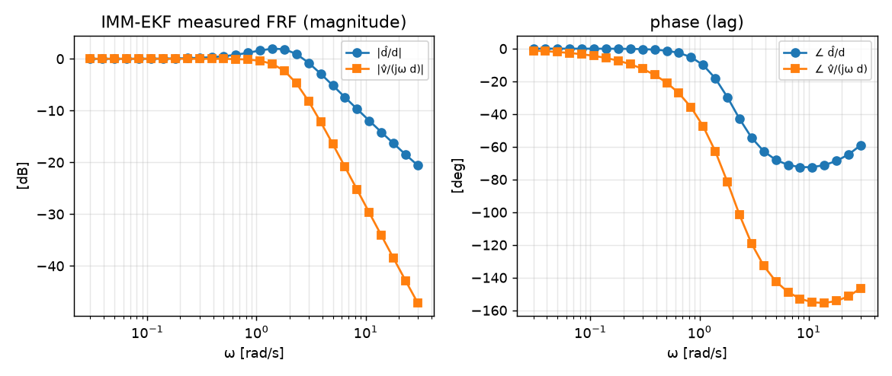
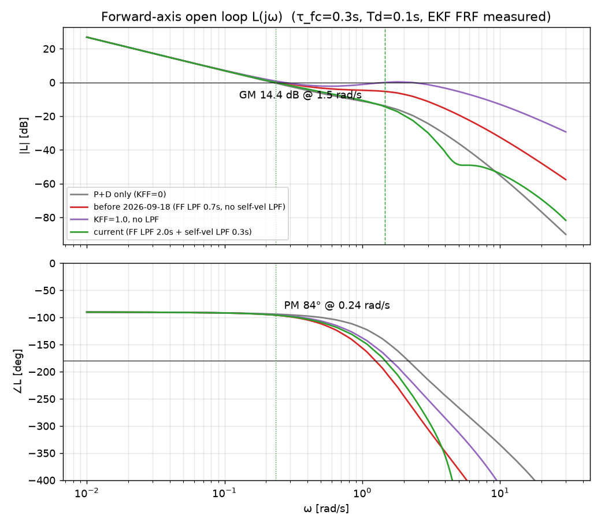
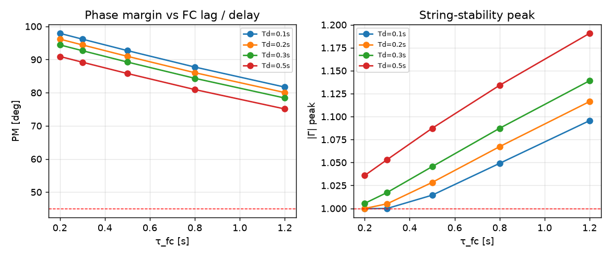
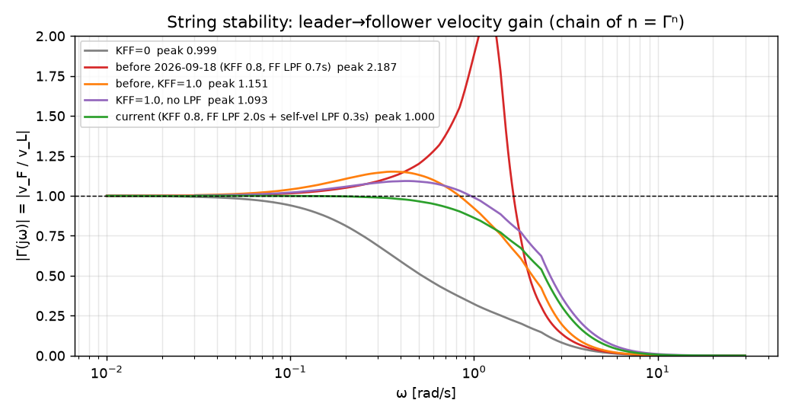
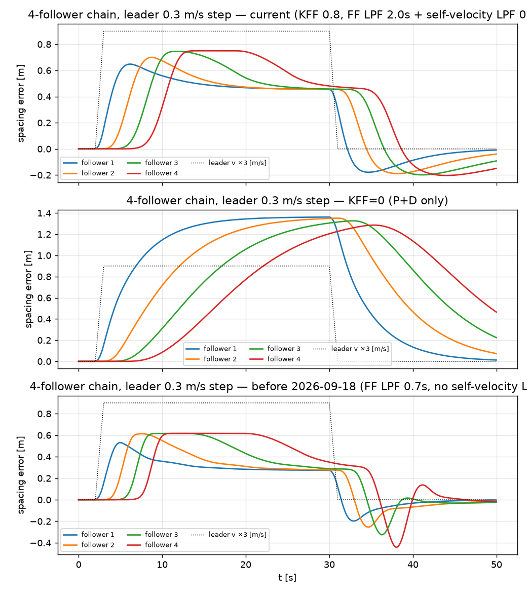

# 바깥 루프 안정성 여유 분석 (2026-09-18)

Jetson 이 만드는 속도 명령 루프(바깥 루프)의 선형 모델을 세워 위상·이득 여유, 감도 피크, 리더→팔로워
속도 전달(스트링 안정성)을 계산하고, 실제 코드(`main.py` 제어 함수 + `imm_ekf.py`)로 돌린 비선형 체인
시뮬레이션과 대조했습니다. **이 분석이 시험 8개가 놓친 결함을 찾았고, 같은 날 코드에 수정을 적용했습니다.**
문서는 수정 전 설계와 현재 설계를 나란히 둡니다. 숫자는 전부 `analysis/stability_margins.py` 가 쓰는
[`stability_margins.json`](stability_margins.json) 에서 왔고, 아래 명령으로 재현됩니다.

```bash
python3 analysis/stability_margins.py --plots      # 표 + docs/images/stability_*.png (약 30초)
python3 analysis/stability_margins.py --identify   # IMM-EKF 주파수응답을 다시 실측 (약 40초)
```

## 1. 결론

| 구성 | PM | GM | Ms | \|Γ\| 피크 (ω) | 스트링 안정 | 정상상태 오차 (0.3 m/s) |
|---|---|---|---|---|---|---|
| P+D 단독 (KFF=0) | 86° | 18.6 dB | 1.18 | 0.999 | 예 | 1.36 m |
| **수정 전** (KFF 0.8, FF 저역통과 0.7 s, 자기 속도 정합 없음, 0.10 램프 데드밴드) | 83° | **4.9 dB** | **2.31** | **1.80 (1.15 rad/s)** | **아니오** | 0.27 m |
| KFF 1.0, 저역통과·정합 없음 | 불안정 | −0.2 dB | 38.9 | 34.2 | 아니오 | 0 |
| **현재 코드** (KFF 0.8, FF 저역통과 2.0 s, 자기 속도 정합 0.3 s, 0.05 소프트 데드존) | 84° | 14.4 dB | 1.29 | 1.13 (0.27 rad/s) | 거의 (1.13) | 0.45 m |

- **P+D 루프 자체는 여유가 큽니다.** 교차 주파수 0.24 rad/s, 위상여유 84~86°, 이득여유 18.6 dB. 이산화(10 Hz)
  영향은 교차 주파수가 나이퀴스트의 0.75 % 라 무시할 수 있습니다.
- **수정 전 피드포워드는 이득여유 4.9 dB, 감도 피크 2.31 로 통상 기준(GM ≥ 6 dB, Ms ≤ 2)에 미달했고,
  1.15 rad/s(주기 5.5 s) 에서 리더 속도 변동을 1.8배 증폭했습니다.** 실제 코드로 돌린 비선형 체인에서도 1.86 이
  재현됐습니다(6절). 4단 체인이면 이론상 1.8⁴ ≈ 10배입니다.
- **원인은 자기 속도 양성 되먹임의 지연 불일치였습니다.** 리더 속도 추정 `v̂_L = v_F(FC 측정) + v̂_rel(EKF)` 에서
  EKF 상대속도는 63 % 응답에 0.30 s 걸리고(실측) FC 자기 속도는 0.1 s 뒤에 들어오므로, 그 사이 자기 속도가
  상쇄되지 않은 채 피드포워드로 되먹임됩니다. 예전 코드 주석은 EKF 지연 1 s 가정에 경로 이득 피크 0.4 미만으로
  봤지만, 실측 지연으로 계산한 경로 피크는 0.46 이고 P+D 루프와 겹치는 위상에서 합쳐져 여유를 깎았습니다.
- **데드밴드 램프도 국소 이득이 3 이었습니다.** `v·(|v|−DB)/DB` 램프는 0.1~0.2 m/s 구간에서 기울기가 최대 3 이라
  실효 KFF 가 2.4 가 됐고, 리더 0.15 ± 0.03 m/s 정현파에서 1단 증폭 3.5 가 관측됐습니다.
- **수정 세 가지**: (1) 피드포워드 저역통과 0.7 → 2.0 s(`leader_vel_ff_tau_sec`), (2) 자기 속도에 EKF 지연과 맞춘
  0.3 s 저역통과(`leader_vel_ff_self_tau_sec`, `main.self_velocity_lpf`), (3) 데드밴드를 기울기 1 인 소프트 데드존
  0.05 m/s 로(`|v|−DB` 만큼 빼기). 이득여유 14.4 dB, 감도 피크 1.29, 양성 되먹임 경로 피크 0.13. 비용은 정상상태
  오차 0.27 → 0.45 m(데드존이 빼는 0.05 m/s × KFF / Kp = 0.18 m) 와 계단 최대 오차 0.53 → 0.65 m 입니다.
- **남는 \|Γ\| 1.13** 은 피드포워드와 P 응답이 겹치는 정상적인 오버슈트로, KFF 0.6 이면 1.02 까지 내려가지만
  정상상태 오차가 두 배가 됩니다(7절 표). 단독 추종이면 지금 값, 3대 이상 체인이면 KFF 0.6 이 맞습니다.
- **SITL 차등 검증으로 확인했습니다.** 정현파 리더 시나리오 `leader_sine`(`sitl/README.md`) 을 ArduCopter SITL 에서
  현재 코드와 수정 전 코드(커밋 e4b4cd7)로 각각 돌린 결과 진폭비 **0.43 / 0.72 (PASS) 대 1.95 (FAIL)**. 예측(선형
  0.67 / 1.8, 비선형 시뮬 0.70 / 2.3) 범위 안이고, 수정 전 코드에서는 미션 상태가 5.5 s 주기로 FOLLOW↔LEADER_HOVER 를
  오가는 부작용까지 관측됐습니다.

## 2. 모델

```
 리더 속도 v_L ─┐
                │  d = x_L − x_F  (상대 거리)
                ▼
   ┌─────────── IMM-EKF (실측 FRF) ───────────┐
   │  d̂ = E_p(s)·d        v̂_rel = E_v(s)·d    │
   └───────┬───────────────────┬───────────────┘
           │                   │
   Kp·(d̂−D*)          Kd·v̂_rel ─┐
           │                   │   v̂_L = H_m·v_F + v̂_rel   (H_m = e^{−s·Tm}/(τ_m s+1): FC 속도 수신 지연 + 정합 저역통과)
           └────────┬──────────┴──── + KFF·H_ff·v̂_L      (H_ff = 1/(τ_ff s+1))
                    ▼ u
        H_s(s) · e^{−s·Td} · H_fc(s)  ──▶ v_F ──▶ 1/s ──▶ x_F
        평활      검출+ZOH   FC 속도루프
```

전후축 기준이며 좌우·상하는 이득만 다릅니다(`KP_RIGHT/KD_RIGHT`, `KP_UP/KD_UP`). 플랜트 입력 `u` 에서 루프를
끊고 `x_L = 0` 으로 두면 `d = −v_F/s` 이므로

```
L(s) = P(s) · [ (Kp·E_p + Kd·E_v)/s  −  KFF·H_ff·(H_m − E_v/s) ],    P = H_s·e^{−s·Td}·H_fc
```

두 번째 항이 자기 속도 양성 되먹임입니다. `E_v/s` 는 EKF 가 보는 "속도 대 실제 속도" 전달이라 저주파에서 1 이고,
`H_m − E_v/s` 는 두 경로의 지연 차이만큼만 남습니다. 정합 저역통과 τ_m 은 `H_m` 을 `E_v/s` 에 가깝게 만들어 이 항을
줄이는 것이고, τ_ff 는 남은 항을 P+D 루프의 위상 교차 아래로 내리는 것입니다. 리더 속도에서 팔로워 속도로의 전달은

```
Γ(s) = v_F/v_L = P·(A + B·C) / (1 + P·(A − B·(H_m − C))),   A = (Kp·E_p + Kd·E_v)/s,  B = KFF·H_ff,  C = E_v/s
```

이고 n 단 체인 끝의 속도 변동은 `Γⁿ` 입니다. 모든 ω 에서 `|Γ(jω)| ≤ 1` 이면 뒤로 갈수록 진동이 커지지 않습니다
(스트링 안정성).

### 가정

| 기호 | 현재 | 수정 전 | 근거 |
|---|---|---|---|
| Kp, Kd (전후) | 0.22, 0.05 | 같음 | `main.py` |
| KFF | 0.8 | 같음 | `config.py` `controller.leader_vel_ff_gain` |
| τ_ff | 2.0 s | 0.7 s | `leader_vel_ff_tau_sec` |
| τ_m | 0.3 s | 없음 | `leader_vel_ff_self_tau_sec` (EKF 속도 지연 실측값) |
| 데드밴드 | 소프트 0.05 (기울기 1) | 램프 0.10~0.20 (기울기 ≤ 3) | `leader_vel_ff_deadband_mps` |
| τ_s | 0.10 s | 같음 | `smooth_velocity_cmd` alpha 0.28 @30 fps 의 등가 시정수 −Δt/ln(1−α) |
| Td | 0.10 s | 같음 | YOLO 추론 ≈ 40 ms + 10 Hz ZOH 평균 50 ms |
| Tm | 0.10 s | 같음 | LOCAL_POSITION_NED 10 Hz 수신 |
| τ_fc | 0.30 s | 같음 | ArduCopter 속도루프 등가 1차 지연 가정. 0.2~1.2 s 로 흔들어 5절에서 확인 |
| E_p, E_v | 실측 | 같음 | 3절 |

## 3. IMM-EKF 주파수응답 실측

EKF 는 IMM 혼합·적응 R 때문에 선형화 대신 실측했습니다. `imm_ekf.ImmEkf` 에 카메라 전방축으로
`d(t) = 3 + a·sin ωt` (최대 가속 2 m/s² 이하) 를 30 Hz 로 넣고, 정착 후 위치 추정 `d̂` 와 속도 추정 `v̂` 를
최소제곱으로 맞춰 복소 이득을 뽑았습니다(0.03~30 rad/s, 28점).



- 속도 추정은 1차 지연에 가깝고, 등속 출발 계단에서 **63 % 도달 0.30 s** 입니다. 예전 `leader_velocity_ff` 주석의
  가정(δ ≈ 1 s)보다 세 배 빨랐고, 그래서 정합 저역통과 τ_m 을 0.3 s 로 잡았습니다.
- 위치 추정은 램프에 정상상태 지연이 없습니다(CV 모델의 2차 추정기 특성. 8 s 후 지연 0.000 m).

## 4. 축별 여유

### 현재 코드

| 축 | Kp / Kd | ω_gc [rad/s] | PM | GM (ω_pc) | 지연 여유 | Ms | \|Γ\| 피크 (ω) |
|---|---|---|---|---|---|---|---|
| 전후 | 0.22 / 0.05 | 0.235 | 84.4° | 14.4 dB (1.47 rad/s) | 6.3 s | 1.29 | 1.13 (0.27) |
| 좌우 | 0.28 / 0.04 | 0.303 | 80.9° | 13.3 dB (1.51 rad/s) | 4.7 s | 1.35 | 1.17 (0.34) |
| 상하 | 0.18 / 0.03 | 0.190 | 85.1° | 14.9 dB (1.35 rad/s) | 7.8 s | 1.26 | 1.10 (0.23) |
| 기수 | KP_YAW 0.8 | 0.79 | 67.4° | 14.4 dB (3.3 rad/s) | 1.5 s | — | — |

### 수정 전 (2026-09-18 이전)

| 축 | ω_gc [rad/s] | PM | GM (ω_pc) | 지연 여유 | Ms | \|Γ\| 피크 (ω) |
|---|---|---|---|---|---|---|
| 전후 | 0.256 | 83.3° | **4.9 dB** (1.25 rad/s) | 5.7 s | **2.31** | **1.80 (1.15)** |
| 좌우 | 0.343 | 78.5° | **4.4 dB** (1.28 rad/s) | 4.0 s | **2.55** | **2.08 (1.18)** |
| 상하 | 0.202 | 84.6° | **5.3 dB** (1.20 rad/s) | 7.3 s | **2.18** | **1.63 (1.11)** |



- 위상여유는 두 설계 다 전 축 78° 이상으로 충분합니다. 문제는 **이득여유** 였습니다. 수정 전에는 위상 교차가
  1.25 rad/s 근처에 생기는데, 이곳의 `|L|` 을 만드는 것은 P+D 항이 아니라(이미 −20 dB 아래) 피드포워드의 자기
  속도 되먹임 항이었습니다. 좌우축이 이득이 커서 가장 나빴습니다(GM 4.4 dB, Ms 2.55).
- 기수 루프는 `cmd = KP_YAW·atan2(right, front)`, `right ≈ −front·ψ` 로 `front` 가 소거되어
  `L_ψ = KP_YAW·H_s·e^{−s(Td+Tatt)}·H_fcψ/s` 입니다(FC yaw-rate 루프 0.2 s 가정). 여유가 넉넉하고, FC yaw 루프 0.5 s
  + 지연 0.3 s 로 나빠져도 PM 48°, GM 9.2 dB 입니다. 좌우 속도와 기수가 같은 `right` 오차를 함께 줄이는 MIMO
  결합은 이 문서에서 다루지 않았습니다(8절).
- 불확실성 감속(0.75 / 0.55 배)은 루프 이득을 낮춰 GM 을 16.9 / 19.6 dB 로 올립니다. 정상 추적 상태가 가장 여유가
  적습니다.

## 5. 강건성: FC 시정수 × 지연 (현재 코드)

`τ_fc` 와 `Td` 를 모르는 범위로 흔들었을 때의 전후축 PM / GM / \|Γ\| 피크입니다.

| τ_fc \ Td | 0.1 s | 0.2 s | 0.3 s | 0.5 s |
|---|---|---|---|---|
| 0.2 s | 86° / 15 dB / 1.11 | 84° / 14 dB / 1.13 | 83° / 13 dB / 1.15 | 80° / 12 dB / 1.19 |
| 0.3 s | 84° / 14 dB / 1.13 | 83° / 14 dB / 1.14 | 82° / 13 dB / 1.16 | 79° / 12 dB / 1.21 |
| 0.5 s | 82° / 14 dB / 1.16 | 80° / 13 dB / 1.18 | 79° / 13 dB / 1.20 | 76° / 12 dB / 1.26 |
| 0.8 s | 78° / 14 dB / 1.21 | 77° / 13 dB / 1.24 | 75° / 13 dB / 1.26 | 73° / 12 dB / 1.33 |
| 1.2 s | 73° / 15 dB / 1.27 | 72° / 14 dB / 1.30 | 71° / 13 dB / 1.34 | 68° / 12 dB / 1.41 |



어느 칸에서도 GM 12 dB 아래로 내려가지 않습니다. 수정 전 설계는 같은 격자에서 GM 4~8 dB, \|Γ\| 1.4~2.2 였습니다.
즉 결론은 FC 모델 가정에 좌우되지 않습니다.

## 6. 스트링 안정성과 체인 시뮬레이션



선형 예측을 실제 코드로 확인했습니다. `chain_sim` 은 리더 + 팔로워 4대를 잇고, 각 팔로워는 앞 기체와의 거리만
카메라 측정으로 받아 **실제 `ImmEkf`, 실제 `leader_velocity_ff`(수정 전은 램프 버전 재현), 실제
`compute_velocity_cmd_from_estimate`, 실제 `smooth_velocity_cmd`** 를 30 Hz 로 돌립니다(10 Hz ZOH 송신, 지연 버퍼,
FC 1차 지연, 잡음 없음).

### 선형 모델 검증 (리더 0.30 ± 0.02 m/s, 데드밴드·포화 밖)

| 구성 | ω [rad/s] | 선형 \|Γ\| | 비선형 1단 진폭비 |
|---|---|---|---|
| 현재 | 1.15 | 0.669 | 0.702 |
| 현재 | 0.35 | 1.115 | 1.158 |
| 수정 전 | 1.15 | 1.802 | 1.863 |
| 수정 전 | 0.35 | 1.083 | 1.127 |
| KFF=0 | 1.15 | 0.284 | 0.303 |
| KFF=0 | 0.35 | 0.579 | 0.602 |

전 구간 4 % 안에서 일치합니다. 선형 모델이 코드를 대표한다고 봐도 됩니다.

### 4단 체인 응답



| 구성 | 계단(0.3 m/s) 단별 최대 \|오차\| [m] | 단별 최소 간격 [m] | 정현파 1.15 rad/s (리더 0.15 ± 0.15) 단별 진폭비 |
|---|---|---|---|
| 현재 | 0.65, 0.70, 0.75, 0.75 | 2.82, 2.81, 2.80, 2.80 | 0.63, 0.69, 0.70, 0.70 |
| 수정 전 | 0.53, 0.61, 0.62, 0.62 | 2.80, 2.75, 2.67, 2.56 | 1.37, 1.13, 1.06, 1.03 |
| KFF=0 | 1.36, 1.35, 1.33, 1.29 | 3.00, 3.00, 3.00, 3.00 | 0.30, 0.30, 0.32, 0.19 |

- 계단 응답만 보면 수정 전이 조금 더 좋아 보입니다. 계단은 1.15 rad/s 성분이 작아 공진을 거의 자극하지 않기 때문이고,
  기존 SITL `depth_range`(등속 리더)가 이상 없이 통과한 이유이기도 합니다.
- 큰 진폭 정현파에서 수정 전의 증폭이 1.37 → 1.03 으로 줄어드는 것은 `MAX_VX` 0.35 포화와 데드밴드가 진폭을
  깎기 때문입니다. 포화가 진동을 막아 주는 셈이라 `MAX_VX` 를 올렸다면 선형값 1.8 쪽으로 커졌을 것입니다.
- 데드밴드 구간(리더 0.15 ± 0.03 m/s)에서 수정 전 1단 증폭은 **3.51**, 현재는 0.70 입니다. 호버 근처에서 천천히
  움직이는 리더가 가장 위험한 조건이었습니다.
- 현재 설계의 자체 피크(0.27 rad/s, 주기 23 s)에서 4단 진폭비는 1.09, 1.09, 1.07, 1.06 입니다.
- SITL `leader_sine` 과 같은 조건(리더 0.25 ± 0.05, 1.15 rad/s, 1단)의 비선형 예측: **현재 0.70, 수정 전 2.31**
  (수정 전은 램프 데드밴드 구간을 지나 더 커집니다). ArduCopter SITL 실측: **현재 0.43 / 0.72, 수정 전 1.95.**

## 7. 설계 선택

### 7.1 피드포워드 저역통과 τ_ff × 자기 속도 정합 저역통과 τ_m (KFF 0.8)

칸 = GM / Ms / \|Γ\| 피크(ω) / 양성 되먹임 경로 피크. 굵은 칸이 수정 전과 현재입니다.

| τ_ff \ τ_m | 0 | 0.3 s | 0.5 s |
|---|---|---|---|
| 0.7 s | **4.9 dB / 2.31 / 1.80 (1.15) / 0.46 (수정 전)** | 8.7 dB / 1.60 / 1.29 (1.00) / 0.27 | 11.1 dB / 1.42 / 1.12 (0.94) / 0.17 |
| 1.0 s | 6.5 dB / 1.91 / 1.44 (0.99) / 0.37 | 10.3 dB / 1.47 / 1.17 (0.76) / 0.22 | 12.6 dB / 1.35 / 1.11 (0.35) / 0.13 |
| 1.5 s | 8.8 dB / 1.60 / 1.18 (0.72) / 0.28 | 12.7 dB / 1.35 / 1.12 (0.35) / 0.16 | 14.6 dB / 1.28 / 1.12 (0.28) / 0.10 |
| 2.0 s | 10.6 dB / 1.46 / 1.13 (0.35) / 0.22 | **14.4 dB / 1.29 / 1.13 (0.27) / 0.13 (현재)** | 16.0 dB / 1.25 / 1.12 (0.24) / 0.08 |
| 3.0 s | 13.3 dB / 1.32 / 1.13 (0.22) / 0.16 | 16.6 dB / 1.23 / 1.13 (0.21) / 0.09 | 17.4 dB / 1.22 / 1.13 (0.20) / 0.05 |

- τ_m 은 자기 속도를 EKF 속도 추정과 같은 지연으로 늦춰 `H_m − E_v/s ≈ 0` 을 만드는 항입니다. 0.3 s 가 실측
  EKF 지연과 같습니다.
- τ_ff 를 2 s 로 늘리면 되먹임 경로가 1.15 rad/s 공진 아래로 내려갑니다. 대신 리더 가감속에 피드포워드가 2 s 늦게
  따라오지만 그 사이는 P+D 가 메우고, 계단 최대 오차는 0.53 → 0.65 m 로 0.1 m 나빠질 뿐입니다.
- 1.13 피크(0.27 rad/s) 는 피드포워드 + P 응답의 겹침이라 τ 로는 안 내려갑니다.

### 7.2 남은 1.13: KFF × Kd (τ_ff 2.0, τ_m 0.3)

칸 = PM / GM / Ms / \|Γ\| 피크 / 정상상태 오차 [m per m/s, 데드존 제외].

| KFF \ Kd | 0.05 (현재) | 0.10 | 0.15 |
|---|---|---|---|
| 0.6 | 85° / 15.8 dB / 1.25 / 1.018 / 1.82 | 88° / 16.1 dB / 1.24 / 1.011 / 1.82 | 90° / 16.1 dB / 1.25 / 1.005 / 1.82 |
| 0.7 | 85° / 15.1 dB / 1.27 / 1.067 / 1.36 | 87° / 15.6 dB / 1.26 / 1.055 / 1.36 | 90° / 15.7 dB / 1.26 / 1.045 / 1.36 |
| 0.8 (현재) | 84° / 14.4 dB / 1.29 / 1.126 / 0.91 | 87° / 15.0 dB / 1.28 / 1.111 / 0.91 | 90° / 15.2 dB / 1.27 / 1.097 / 0.91 |

정상상태 오차와 스트링 피크의 교환입니다. 단독 추종이면 KFF 0.8 + 1.13 이 낫고, 3대 이상 체인이면 KFF 0.6(1.02,
4단 끝 1.07배) 이 안전합니다. 체인 운용 시 ESP32 로 선두 절대 속도를 방송받으면 자기 속도 경로 자체가 사라져 이
교환이 없어집니다.

### 7.3 데드밴드

수정 전: `target = v·clamp((|v|−DB)/DB, 0, 1)`, DB 0.10 → DB < |v| < 2DB 에서 국소 기울기 최대 3.
현재: `target = v·max(0, 1 − DB/|v|)`, DB 0.05 → 기울기 1. 빼는 만큼 정상상태 오차가 `KFF·DB/Kp` 늘어(0.10 이면
0.36 m, 0.05 면 0.18 m) 폭을 반으로 줄였습니다. 호버 잡음은 2.0 s 저역통과가 평균내므로 데드존은 바이어스만 막으면
됩니다.

## 8. 한계

- SISO 축별 분석입니다. 좌우 속도와 기수가 함께 `right` 오차를 줄이는 결합, 자세 보상이 축을 섞는 효과는 포함하지
  않았습니다.
- FC 속도루프를 1차 지연으로 놓았습니다. ArduCopter 의 실제 응답(`PSC_VELXY_P`, 가속 제한, 자세 루프)은 SITL 에서
  속도 계단으로 식별해 `τ_fc` 를 확정해야 합니다. 5절 표는 그 전까지의 범위 보증입니다.
- 측정 잡음, 검출 누락, 포화(`MAX_V*`)는 선형 모델에 없습니다. 체인 시뮬레이션에는 포화·데드밴드가 있고 잡음은 없습니다.
- 기수 루프의 EKF 경로는 ego-yaw 보정이 즉시 적용된다고 보고 ATTITUDE 수신 지연 0.1 s 만 넣었습니다.
- 실제 FC 검증은 SITL(`leader_sine`) 까지입니다. 실기의 FC 속도루프·바람·측정 잡음은 포함되지 않았습니다.

## 9. 파일

| 파일 | 내용 |
|---|---|
| `analysis/stability_margins.py` | 모델·여유 계산·체인 시뮬레이션·그림. `BEFORE` 가 수정 전 설계 |
| `docs/stability_margins.json` | 계산 결과와 EKF 실측 FRF (문서 숫자의 원본, `analysis/trace_check.py` 가 참조) |
| `docs/images/stability_*.png` | 보드 선도, 스트링 안정성, 체인 응답, 강건성, EKF FRF |
| `test_fixes.py` `분석:` 검사 | 기준선(P+D) 여유, 수정 전 골든값(결함의 기록), 현재 설계 여유를 회귀로 고정 |
| `sitl/harness.py` `leader_sine` | 같은 조건을 실제 ArduCopter 에서 검사하는 시나리오 |
